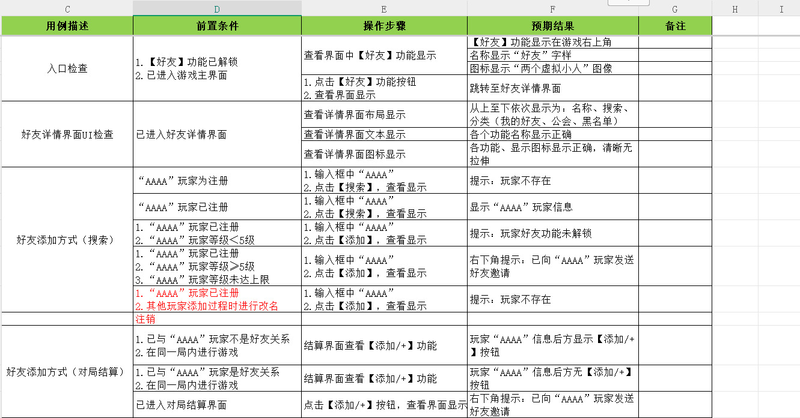

> [!IMPORTANT]
>
> 1.一切未知的地方都存在风险                             2.一切和需求不符合的都是BUG                      3.破坏性测试思维

# 长期项目

## 项目分析案例

两款游戏（类型不要重复）并提前熟悉：
游戏类型：Moba、FPS、RPG、SLG、ACT、竞速、自走棋、开放性世界。
游戏公司：中型，游戏不要太火爆（排名），不能与腾讯有关系（不允许QQ、微信登录）

项目相关：人员结构，用例数量，版本周期

### 街头篮球

策划周期 3个月

开发周期 4个月

测开周期 8个月

- 版本周期
  1. 大版本：2个月 	1.2月出包测试  	测试周期14天
  2. 小版本：一周	周三给包	周三周四测试

- 人员组成

  ​            3测试       8开发      4产品和策划

- 用例数量

  ​	 80000+

### 我的勇者（预估）

策划周期 1个月

开发周期 3个月

测开周期 5个月

- 版本周期

  1. 大版本：2个月 	1.2月出包测试  	测试周期14天
  2. 小版本：一周	周三给包	周三周四测试

- 人员组成：预估23人

  ​            5测试       13开发      5产品和策划

- 用例数量

  ​	 80000+

### 交错战线（预估）

策划周期 1个月

开发周期 3个月

测开周期 5个月

- 版本周期

  1. 大版本：2个月 	1.2月出包测试  	测试周期14天
  2. 小版本：一周	周三给包	周三周四测试

- 人员组成：预估23人

  ​            5测试       13开发      5产品和策划

- 用例数量

  ​	 80000+

现在运营期间产出每月每人产出用例数：160/5=32条左右（预估）

## 项目选择过程

### **浮空秘境**

- [x] Tap Tap下载人数：400万

- [x] Tap Tap关注度：200万

- [x] 游戏安装包大小：700 MB

- [x] 游戏类型：冒险解谜类

- [x] 上线时间：2023

- [ ] 横板OR竖版：竖版=》》**NO**

- [x] 非腾讯旗下游戏：是

- [x] 国内开发团队：是

- [x] 游戏丰富度：OK

  最终判断：**NO**，横板

### **尘白禁区**

- [ ] Tap Tap下载人数：982万

- [ ] Tap Tap关注度：615万

- [x] 游戏安装包大小：746 MB

- [x] 游戏类型：二次元、动作、射击、TPS、美少女

- [x] 上线时间：2023-7-19

- [x] 横板OR竖版：横板OK

- [x] 非腾讯旗下游戏：是

- [x] 国内开发团队：西山居

- [x] 游戏丰富度：OK

  最终判断：NO，热度太火了

### **我的勇者**

- [x] Tap Tap下载人数：690万

- [x] Tap Tap关注度：411万

- [x] 游戏安装包大小：1020 MB

- [x] 游戏类型：像素\RPG\地牢\冒险

- [ ] 上线时间：2019-8

- [x] 横板OR竖版：横板OK

- [x] 非腾讯旗下游戏：是

- [x] 国内开发团队：魔力数娱

- [x] 游戏丰富度：OK

  最终判断：NO，发行太久了

### 	**解忧小村落**

- [x] Tap Tap下载人数：156万

- [x] Tap Tap关注度：127万

- [x] 游戏安装包大小：465 MB

- [x] 游戏类型：种田\国风\经营\休闲\模拟\养成

- [x] 上线时间：2023-1-8

- [x] 横板OR竖版：横板OK

- [x] 非腾讯旗下游戏：是

- [x] 国内开发团队：古德工作室（绍兴天石网络科技有限公司）

- [x] 游戏丰富度：OK

  最终判断：OK（备选）（同时担心内容太少了）

### **交错战线**

- [x] Tap Tap下载人数：234万

- [x] Tap Tap关注度：159万

- [x] 游戏安装包大小：1900 MB

- [x] 游戏类型：二次元\RPG\机甲\对战

- [x] 上线时间：2024-1-2

- [x] 横板OR竖版：横板OK

- [x] 非腾讯旗下游戏：是

- [x] 国内开发团队：广州米茄科技有限公司

- [x] 游戏丰富度：OK

  最终判断：OK，（上线刚一年）

## 公司背景调查

### 游戏开发厂商（交错战线）

**厂商名称**：广州米茄科技有限公司（简称“米茄游戏”）

**公司规模与实力**

- **人员规模**：公司参保人数为88人，实际人员规模可能在50~99人之间。
- **知识产权**：公司拥有多项知识产权，包括1个企业品牌项目、86个注册商标、3个专利信息和26个软件著作权。这些知识产权的拥有，表明公司具有较强的创新能力和技术实力。

**厂商简介**：

米茄游戏成立于2018年，是一家由二次元机甲爱好者组建的公司。公司主要以开发二次元机娘为核心的游戏，并致力于传播机娘文化。《交错战线》是米茄游戏的首款正式作品，凭借其出众的立绘和独特的游戏设定，吸引了大量玩家的关注。

### 游戏开发工作室

由于米茄游戏本身规模相对较小，且专注于二次元机娘游戏的开发，因此其内部可能并没有设立多个独立的工作室来分别负责不同项目的开发。不过，可以认为米茄游戏整个公司就是一个专注于《交错战线》等二次元机娘游戏开发的工作室。

**工作室规模**：相对较小，但拥有一支充满热情和创造力的开发团队。

**所在地**：广州市天河区。

**工作室旗下其他游戏**：

- 目前已知的主要作品是《交错战线》，这是米茄游戏的首款正式作品，也是他们围绕二次元机娘文化开发的一款科幻题材的机甲美少女游戏。

**游戏上线时间**：

- 《交错战线》于2024年1月3日正式公测，玩家可以在游戏中作为星系探索队的总队长，带领一众成员探索星系，并在过程中遭遇敌人、结识伙伴。


# 假期任务

## 1.假期寻找（两个项目）

《交错战线》 《我的勇者》

## 2.负责项目（7-10）模块

交错战线：

1. 好友 OK

2. 背包  OK

   添加 芯片素材 

3. 乌斯怀亚-123技能

   

我的勇者：

1. 商城
2. 大副本-050关测试用例
3. 活动

3.测试点（100%）用例（每个项目3个模块）

交错战线：

1. 好友 OK
2. 背包  
3. 乌斯怀亚-123技能

我的勇者：

1. 商城
2. 大副本-050关测试用例
3. 月签到活动

## 4.用例评审（）没人参加>=1个模块

## 5.BUG(10个不用类型的Bug)（需要可以测试出来）

交错战线：

1. 【背包】【物品】物品排序检查，点击排序后排序不起作用

   

2. 【任务】系统红点，点击后不消失

3. 


## 6.总结


# 面试

## 问题

1. 自我介绍
2. 测试过哪些模块，怎么测试的
3. 给你一把枪你怎么测试的


## 语音讲解

1. [测试流程（李哥版）](https://bob-mou.github.io/docs/Document/测试流程（李哥版）.m4a)							[测试流程（李哥版）本地](./Document/测试流程（李哥版）.m4a)
2. [模拟面试（不完整）](https://bob-mou.github.io/docs/Document/模拟面试（不完整）.m4a)                                                        [模拟面试（不完整）本地](./Document/模拟面试（不完整）.m4a)

# 安全

## 一、信息安全

1. 信息（账号、项目资料、验证）不能外传。
2. 不能携带（存储设备、私人电脑、设备）
3. 不允许拍照
4. 不允许透露薪资架构（保密协议）
5. 腾讯福利不允许变现：
   - 测试账号（Q币、Q点）点券
   - 腾讯发给你的私人账号货币福利变现
   - 不能在外网服务器暴露自己是测试人员

## 二、黑产

### 1、木马

开发-》分销-》挂马出信-》洗信出马

钓鱼链接

捆绑木马软件

APK，IPA，EXE

### 2、开挂

开发外挂、修改（数据）

1. 截获客户端发给服务器得数据包，修改后发送
2. 截获服务端发给客户端得数据包，修改后发送
3. 修改客户端内存
4. 服务器数据（黑客攻击 ）
5. 修改客户端配置文件

客户端挂，目标是游戏客户端（包括客户端得操作系统），一般通过增删改的方式实现，工具有调试工具（ollydbg）,反编译工具（IDA） 内存查看工具（cheatEngine）。需要对游戏引擎，游戏逻辑，操作系统有所了解。

常见的游戏引擎有：

主流中很常用的游戏引擎分别为，ue4，unity，cocos，laya，egret，在国内其中unity、ue4占比最多，其次是cocos，再者是laya和egret。

### 3、代练

影响游戏平衡和玩家体验

### 4、演员

影响游戏平衡和玩家体验

## 三、违规信息安全

涉黄（模型，外观，动作，语言，文字，图片），暴力（血腥，动作，文字），涉政（党政军），欺诈，赌博，宗教，敏感词（脏话）

PS：抽奖概率测试怎么进行

# 游戏评测

## 游戏美术


## 系统相关


## 体验相关


> [!NOTE]
>
> **当后面一个部分和前面的有交集的时候是否需要全部重新测试**？

# 游戏测试

## 1、定义：

- 2个保证：保证正常运行（安装解析运行卸载）和保证版本质量
- 2个建议：保证易用性和可玩性

## 2、游戏测试的理解：

1. 游戏是一种特殊的软件
2. 游戏需要软件工程知识，也需要专业的游戏测试（可玩性，美术效果，策划合理性）
3. 测试是一个枯燥的过程，需要反复测试

> [!NOTE]
>
> ### 面试：1、测试是个反复枯燥的过程。2、你个人有哪些优缺点

## 3、测试组成


### 1、 传统软件测试

1. 测试的目的时发现软件中的缺陷
2. 测试依据：需求/产品规格说明书
3. 每一个测试必须在真是产品或虚拟环境运行
4. 测试需要以系统方法展示产品功能：测似点，测试用例，执行记录证明测试结果：用例执行证明，提交发现提交BUG清单让开发进行修改，最后形成测试报告。

### 2、游戏本身的测试

#### 	a、游戏测试的特性

1. 游戏情节的测试：游戏的任务系统的组成，即游戏的时间驱动
2. 游戏的平衡测试：经济平衡，能力平衡（包括技能、属性、种族、装备、经济系统等），保证公平性
3. 游戏的文化测试：游戏风格是中国主导还是日韩风主导，从NPC到游戏整体。

#### 	b、游戏的可玩性测试

游戏世界的搭建，保证游戏的可玩性。

## 4、游戏测试和软件测试的区别


## 5、测试工具


> [!NOTE]
>
> 角色三C是什么？
>
> 答：在游戏设计和开发中，“角色三C”通常指的是以下三种主要角色：
>
> 1. **C（Character，角色）**：指的是游戏中的人物角色。这个角色可以是玩家控制的主角，也可以是游戏世界中的非玩家角色（NPC）。角色的设计通常涉及其背景故事、个性特征、能力、外观以及在游戏中的作用。好的角色设计能增加玩家的代入感和游戏的沉浸感。
> 2. **C（Camera，镜头）**：指的是游戏中的视角或镜头系统。镜头是玩家与游戏世界互动的窗口，设计良好的镜头可以提升游戏的可玩性和视觉体验。例如，镜头的运动、视角的变化、以及与角色的同步性都非常重要，能影响玩家的游戏体验。
> 3. **C（Control，控制）**：指的是玩家与游戏的互动方式，即控制系统。控制系统设计需要保证玩家操作的流畅性和准确性。无论是通过键盘、鼠标、手柄、触屏，控制系统都需要易于上手并能够支持游戏的玩法需求。
>
> 这三个“C”概念常常在游戏设计过程中相互交织，影响着游戏的整体体验：
>
> - **角色（Character）**决定了玩家的代入感和情感联系。
> - **镜头（Camera）**影响了玩家的视觉体验和对环境的感知。
> - **控制（Control）**则是游戏操作的核心，确保玩家能顺利地与游戏世界互动。
>
> 设计团队通常会平衡这三方面，以确保游戏既有深度又能提供良好的用户体验。如果你在做游戏设计或者相关的开发，理解并优化这三个方面是提升游戏质量的重要步骤。

## 6、玩家的期望

1. 对操作的希望：一致性
2. 对目标的期望：明确
3. 对界面的希望：体贴友好
4. 对感觉的希望，沉浸
5. 对规则的期望：逻辑

## 7、游戏的分类

端游、手游、页游、H5游戏

1. **角色扮演游戏（Role-Playing Game, RPG）**

**介绍**：玩家通过扮演角色，探索虚拟世界，完成任务并提升角色能力，通常伴随深度剧情和开放性玩法。
**例子**：

- 端游：
  - 《巫师3：狂猎》
  - 《上古卷轴5：天际》
  - 《博德之门3》
- 手游：
  - 《原神》
  - 《崩坏：星穹铁道》
  - 《放置奇兵》

------

2. **动作游戏（Action Game, ACT）**

**介绍**：以玩家的反应速度、操作能力为核心，包含战斗、跳跃和解谜等内容。
**例子**：

- 端游：
  - 《战神》系列
  - 《鬼泣5》
  - 《只狼：影逝二度》
- 手游：
  - 《影之刃3》
  - 《帕斯卡契约》
  - 《忍者必须死3》

------

3. **第一人称射击游戏（First-Person Shooter, FPS）**

**介绍**：玩家以第一人称视角体验射击和战斗，通常注重战术协作和精确射击。
**例子**：

- 端游：
  - 《使命召唤：现代战争》
  - 《CS:GO》
  - 《Apex英雄》
- 手游：
  - 《和平精英》
  - 《使命召唤手游》
  - 《穿越火线：枪战王者》

------

4. **即时战略游戏（Real-Time Strategy, RTS）**

**介绍**：玩家实时管理资源、建设基地、指挥军队，考验战略部署能力。
**例子**：

- 端游：
  - 《星际争霸2》
  - 《帝国时代4》
  - 《魔兽争霸3》
- 手游：
  - 《红警OL》
  - 《战争艺术：赤潮》
  - 《王国纪元》

------

5. **大型多人在线角色扮演游戏（Massively Multiplayer Online Role-Playing Game, MMORPG）**

**介绍**：玩家在一个大型共享世界中进行冒险，强调社交、任务和团队合作。
**例子**：

- 端游：
  - 《魔兽世界》
  - 《最终幻想14》
  - 《黑色沙漠》
- 手游：
  - 《天涯明月刀手游》
  - 《龙之谷2》
  - 《剑网3：指尖江湖》

------

6. **沙盒游戏（Sandbox Game, Sandbox）**

**介绍**：提供开放的世界，玩家可以自由探索、建造和创造，而不受任务限制。
**例子**：

- 端游：
  - 《我的世界》
  - 《方舟：生存进化》
  - 《泰拉瑞亚》
- 手游：
  - 《迷你世界》
  - 《创造与魔法》
  - 《ROBLOX》

------

7. **冒险游戏（Adventure Game, AVG）**

**介绍**：注重故事和世界探索，通常包含解谜和互动对话元素。
**例子**：

- 端游：
  - 《奇异人生》
  - 《古墓丽影》系列
  - 《塞尔达传说：旷野之息》
- 手游：
  - 《迷室》系列
  - 《未定事件簿》
  - 《暖雪》

------

8. **生存游戏（Survival Game）**

**介绍**：玩家需要在恶劣环境中收集资源、建造设施，并对抗敌人或环境威胁。
**例子**：

- 端游：
  - 《森林》
  - 《七日杀》
  - 《Rust》
- 手游：
  - 《明日之后》
  - 《辐射：避难所》
  - 《荒野行动》

------

9. **塔防游戏（Tower Defense, TD）**

**介绍**：玩家通过建造防御塔阻止敌人到达目标，注重策略性。
**例子**：

- 端游：
  - 《植物大战僵尸》
  - 《保卫萝卜》
  - 《王国保卫战》
- 手游：
  - 《植物大战僵尸2》
  - 《王国保卫战》手游版
  - 《Bloons TD6》

------

10. **解谜游戏（Puzzle Game）**

**介绍**：以逻辑思考、观察能力和创造性解谜为核心玩法。
**例子**：

- 端游：
  - 《纪念碑谷》
  - 《The Witness》
  - 《Portal 2》
- 手游：
  - 《纪念碑谷2》
  - 《糖果传奇》
  - 《脑洞大师》

------

11. **竞速游戏（Racing Game, RCG）**

**介绍**：玩家通过操控车辆进行比赛，注重速度和操控技巧。
**例子**：

- 端游：
  - 《极品飞车》系列
  - 《地平线：零之曙光》
  - 《尘埃》系列
- 手游：
  - 《QQ飞车手游》
  - 《狂野飙车9》
  - 《极限竞速：街头传奇》

------

12. **卡牌游戏（Card Game, CCG/TCG）**

**介绍**：玩家通过收集和使用卡牌进行战斗或解谜。
**例子**：

- 端游：
  - 《炉石传说》
  - 《昆特牌》
  - 《影之诗》
- 手游：
  - 《炉石传说》手游版
  - 《影之诗》手游版
  - 《三国杀移动版》

------

13. **格斗游戏（Fighting Game, FTG）**

**介绍**：玩家操控角色进行一对一或多对多的近身战斗。
**例子**：

- 端游：
  - 《街头霸王》系列
  - 《拳皇》系列
  - 《真人快打》系列
- 手游：
  - 《拳皇命运》
  - 《街霸：对决》
  - 《火影忍者：疾风传》

------

14. **模拟经营游戏（Simulation Game, SIM）**

**介绍**：玩家管理某种系统（如城市、农场或人生），强调规划与资源管理。
**例子**：

- 端游：
  - 《模拟人生》系列
  - 《文明6》
  - 《城市：天际线》
- 手游：
  - 《梦幻花园》
  - 《模拟城市：我是市长》
  - 《部落冲突》

------

15. **音乐节奏游戏（Music/Rhythm Game）**

**介绍**：玩家通过按键或触摸与音乐节奏互动。
**例子**：

- 端游：
  - 《DJMAX RESPECT》
  - 《节奏地牢》
  - 《OSU!》
- 手游：
  - 《节奏大师》
  - 《Cytus II》
  - 《古树旋律（Deemo）》


# 测试流程

## 测试类型


功能 冒烟 随机 黑盒 全量 白盒 灰盒 回归 验收 探索 压力 性能 兼容性 边界条件 逆向负载 稳定性 接口 自动化 UI测试 安全 本地化 单元 集成 系统 验收 扩展性

## 测试职责

1. 功能测试
2. 可玩性
3. 尽快介入，尽快完成，持续不断
4. 玩家立场评测

## 开发流程

市场=》策划=》开发=》运营=》市场


## 测试流程

1. 开始
2. 需求分析
3. 需求评审
4. 测试计划制定
5. 提取测试点
6. 编写测试用例
7. 用例评审
8. 测试前准备
9. 冒烟测试
10. 执行测试用例
11. BUG提交
12. BUG跟踪
13. BUG回归
14. 最终包全量测试
15. 编写测试总结
16. 汇报测试报告
17. 结束

## 新版本测试执行策略

完整=》随机=》回归=》发布=》冒烟=》完整

## 游戏生明周期

1. 立项
2. 首版
3. 技术封测
4. 删档内测
5. 不删档内测
6. 公测
7. 产品下线


# 需求分析

## 需求分析-评审

- **分析**：验证需求正确性、完整性、无二义性
- **评审**：再次确定需求内容，开发确定可开发，测试确定可测试
- **人员**：策划、开发、测试
- **产出**：新版本需求文档

## 需求分析的范围

1. 需求背景、目标、影响范围（交互模块）
2. 提示方式，异常处理
3. 主流程、操作流程和步骤说明是否合理
4. 需求上下文的一致性

## 需求分析方法

1. 全局观考虑
2. 业务流程分析
3. 补充测试点

### 一、全局观考虑

1. 了解需求主要目的，了解功能业务流程，硬件软件环境，交互模块等
2. 分析需求中的疑问及问题
3. 列出需求中不合理、不合逻辑、不能实施、歧义和含义不明确的语句
4. 挖掘隐藏需求

### 二、业务流程分析

1. 画流程，检查流程图合理性、准确性
2. 检查分支流程、用户权限说明、规则和边界值是否缺失
3. 检查是否存在异常分支、不确定范围
4. 流程图列出每个阶段测试点

### 三、补充测试点

1. 补充测试点，比如UI测试点，进入方式等
2. 探索式测试方法补充测试点
3. 对需求的疑问和测试范围**再次确认**

### 需求分析方法（贯口）

- 疑问插批注
- 数字找边界
- 时间问刷新
- 交易“重”到账
- 任务画流程图

# 测试计划制定

测试主管/组长分配组员任务，评估时间点

# 测试点


## 背包测试点


### 思维导图：


## 商城测试点


### 思维导图：


## 亲密度测试点


### 亲密度需求文档链接如下：

> **[需求原文链接](https://bob-mou.github.io/docs/Document/亲密度系统.docx)**              **[需求原文本地链接](./Document/亲密度系统.docx)**

### 思维导图：


## 好友测试点


### 思维导图：


## 技能测试点


### 思维导图：


## 枪械测试点


### 思维导图：


## 载具测试点


### 思维导图：


## 跳伞测试点


### 思维导图：


## 副本测试点


### 思维导图：


## 活动测试点


**火影应援需求文档链接如下**：

> **[需求原文链接](https://bob-mou.github.io/docs/Document/火影应援活动需求.docx)**          	**[需求原文本地链接](./Document/火影应援活动需求.docx)**

### 思维导图：


# 测试用例

## 概念

是为了测试目的（需求/功能）而编写的一组测试条件、测试输入、以及预期结果，已便测试程序路径的或核实是否满足某个特定需求

## 八大要素

1. 优先级
2. 用例编号
3. 所属模块
4. 用例描述
5. 前提条件
6. 操作步骤
7. 预期结果
8. 备注

## 用例的种类

### 全功能测试

涵盖全部的测试对象的全部功能测试用例

### 通用用例

不同模块的的通用功能的测试用例

### 最小检查点

容易出BUG 的点

### 冒烟用例

重点功能测试用例

### 专项用例

性能、弱网、兼容

## 用例设计方法

### 一、等价类划分法

少量代表性测试数据，即可取得比较好的测试结果。等价划分分为有效等价和无效等价。有效等价类：对规格说明是合理的，有意义的输入数据构成的集合。

举例;

1.输入值判定。

2.功能判定，角色穿戴装备，攻击范围判定。

### 二、边界值划分法

对输入和输出的边界值进行测试的一种黑盒测试方法。

实例:

X取值$x \in \mathbb{(3,20)}$

测试用例6条,{2,3,4,19,20,21}

### 三、错误推断法

基于经验和直觉推测程序可能出现的错误

### 四、判定表法

判定表法分析和表达多逻辑条件线下的执行不同操作。

1. 条件桩(condition stub)
2. 动作桩(action  stub)
3. 条件项(condition Entry)
4. 动作项(action Entry)

### 五、场景设计法

通过使用“场景”对软件系统的功能点或业务流程进行描述的方法，包括**基本流和备选流**。常用UML用例设计方法。需要覆盖用例的主要成功场景和扩展场景，并且补充适当的正反卖弄测试用例和考虑异常的操作出现。

## 测试用例

### 实例：好友模块



### 交错战线


### 我的勇者


## 用例评审

### 1.组内评审

测试组员编辑测试用例，其他组员提出问题和建议（评审时标记），修改优化后的测试用例输出大群（测试、开发、策划）查看

### 2.三方评审

测试组（所有人用例编写完成后）与开发策划协商时间点，测试主导会议，会议中提出问题和建议（评审时标记），修改优化后的测试用例输出大群（测试、开发、策划）查看。

### 3.用例编写完成后，用例上传归档

**问题：用例一定要经过测试、开发的评审后才能执行吗？**


# BUG


## 要素


1. 标题:[平台]（安卓 OR IOS）简要描述BUG的情况
2. 测试环境概述：硬件平台 操作系统 网络环境 账号
3. 复现步骤：1.   2.    3.   4.    5.  
4. 复现概率：必现、偶现、
5. 实际现象：BUG结果、游戏崩溃
6. 严重程度：致命、严重、一般、轻微
7. 优先级：紧急、高、中、低
8. 指派人：BUG解决者（开发/策划）
9. 附件：视频、图标、Log日志


提交BUG单


### 印象深刻的BUG（口诉）


## BUG种类

### 文字描述类BUG

标签页、标签页中的时间显示、文字描述、礼包详情等等

### 实际和需求不一致的BUG

比如文字和文档不符合，奖励和文档不符合，奖励数量和需求不符合、图片、按钮显示位置和文档不符合等

### UI类BUG

文字显示格式、图片、图片重叠、显示和内容不一致

### 功能操作类BUG

功能阻碍、操作后和预期不符合、卡顿

## BUG问题相关


# 测试前准备

测试账号：项目组提供，自己注册，账号是否需要添加白名单（项目组要求）

测试设备：功能测试，中高端机器，安卓，ios，鸿蒙,

测试网络：测试组专用WIFI，网络IP是否添加白名单

测试资源准备:SVN，沟通群下载，云盘下载

1.测试包获取，测试包版本核对-》安装

2.道具准备、配置表资源获取

3.GM工具获取

# 冒烟测试

## 主功能冒烟

针对已经实现的功能进行验证，验证是否有入口且正确

## 全量冒烟

针对已经实现的功能进行验证，验证功能入口，以及所有的分支和执行流程正确

## 冒烟用例

提取全部功能的用例的5%，去执行。

# BUG执行


通过：P绿色

不通过：F红色

N/A阻碍（未实现）


# BUG生命周期


# 工具

## adb

常用命令

```
adb logcat --help 帮助
```

1.设备连接

确定硬件状态正常（包括Android设备处于正常开机状态，USB连接线和各种接口完好）。
Android设备的开发者选项和USB调试模式已经开启（在[设置]-[开发者选项]-[USB调试]打开USB调试）。
确认设备驱动状态正常（安装ADB驱动程序）。
通过USB线连接点好和设备后确认状态。
通过adb devices命令查看设备连接情况。

2.logcat抓取日志

```
adb logcat -v  time >D:ceshilog.log
adb logcat -v  time >E:logs\ceshilog.log
使用-v选项设置日志的输出格式。例如，adb logcat -v time会以时间格式显示日志。
```

3.shell 命令

```
adb shell 进入shell模式
pm list package |grep fun //使用包管理器寻找包含fun的包
```

4.随机事件模拟

```
adb shell monkey -p fun.bantong.fish.c -v 100000 >D:随机测试.log
```

5.adb 安装软件

```
adb install  软件包地址
比如：
adb install E:\fun.bantong.fish.apk
```

## 过滤日志输出

日志消息的标记是一个简短的字符串，指示消息所源自的系统组件。例如，“View”表示视图系统。

优先级是以下字符值之一（按照从最低到最高优先级的顺序排列）：

- `V`：详细（最低优先级）
- `D`：调试
- `I`：信息
- `W`：警告
- `E`：错误
- `F`：严重错误
- `S`：静默（最高优先级，绝不会输出任何内容）

1. 按标签过滤

   使用`-s`选项指定要过滤的日志标签。例如，`adb logcat -s ActivityManager`只会打印TAG为ActivityManager的日志。

2. 按级别过滤使用`*:E`等形式的过滤器来指定日志级别。例如，`adb logcat *:E`只会打印级别为Error的日志。

3. 使用grep过滤

   可以通过管道将`adb logcat`的输出传递给`grep`命令进行正则表达式过滤。例如，`adb logcat | grep MyApp`只会输出包含“MyApp”字符串的日志行。

4. 按进程ID过滤

   使用`--pid=`选项指定要过滤的进程ID。例如，`adb logcat --pid=12345`只会打印进程号为12345的日志。

5. 日志级别来过滤日志输出

使用adb logcat命令时，可以通过指定日志级别来过滤日志输出。例如：

1. **打印所有级别的日志**（默认情况）：

   ```bash
   adb logcat
   ```

2. **打印级别为Verbose及以上的日志**：
   由于Verbose是默认级别，因此不需要特别指定。但可以通过指定其他级别来间接实现，例如只打印Error级别及以上的日志后再恢复为Verbose级别（通常不这么做，因为直接打印所有级别更常见）。

3. **打印级别为Debug及以上的日志**：
   实际上，adb logcat命令没有直接提供只打印Debug级别及以上的选项。但可以通过不指定级别（即默认打印所有级别）或使用更高级别的过滤器（如Error）后再结合其他方法（如grep）来间接筛选Debug级别的日志。不过，通常开发者会关心特定标签的Debug日志，因此更常用的是按标签和级别组合过滤。

4. **打印级别为Info及以上的日志**：
   同样地，adb logcat命令没有直接提供只打印Info级别及以上的选项。但可以通过不指定级别或使用更高级别的过滤器来间接实现。

5. **打印级别为Warn及以上的日志**：

   ```bash
   adb logcat *:W
   ```

   这里的`*:W`表示所有标签（`*`）的日志级别为Warn（`W`）及以上。

6. **打印级别为Error及以上的日志**：

   ```bash
   adb logcat *:E
   ```

   这里的`*:E`表示所有标签的日志级别为Error（`E`）及以上。

7. **打印级别为Fatal/Assert的日志**：
   Fatal级别通常与程序崩溃相关，而Assert级别用于断言失败时。由于Fatal级别较为特殊且通常与程序崩溃紧密相关，因此在实际使用中可能更关注Error级别及以上的日志来间接包含Fatal级别的日志（因为Fatal级别在Error级别之上）。对于Assert级别，则可以通过指定特定标签和级别的组合来过滤。

**[ADB常用调试命令文档](https://bob-mou.github.io/docs/Document/Android调试常用命令.docx)**  

## perfdog

性能测试，腾讯收费软件

## solox

性能测试，一个仿perfdog程序

python -m solox （默认）

# 测试总结与报告

# 专项测试

> [!NOTE]
>
> 问：专项测试是在什么时候进行测试的？
>
> 回答：专项测试是在功能测试结束

## 专项测试类型

1. ### 中断

2. ### 兼容性

3. ### 弱网

4. ### 性能

5. ### 安全（外挂）

## 1、中断：

### 定义：

测试程序在遭遇意外中断时的响应能力与稳定性

### 常见中断

常见中断：媒体（音乐）、提醒、锁屏、照相按钮、短信、来电、通话、手机语音、数据线插拔、WIFI连接提醒、低电量运行、闹钟

网络终端：2G、3G、4G、5G、飞行模式、丢包、DNS高延迟、手机弱网

暴力测试：关机、重启、拔电池、关闭进程、长时间使用、运行后台切换、存储解除拔出

## 2、兼容性：


定义：兼容性测试是指对所设计的软件的在软件与硬件、软件之间的兼容性的测试，兼容性测试是指软件测试在特定的硬件平台上、不同的应用程序之间、不同的操作系统上不同网络环境等情况下能够很友好的运行测试。

硬件、操作系统、屏幕、分辨率

### 测试方法：

web测试和app测试

1. 全手工人工测试
2. 第三方家兼容性工具测试

优缺点：全人工测试，工作量大，覆盖不全；第三方兼容性工具测试，工作量小，主功能和主流程测试没有侧重点。两者结合才是最好的测试方法。

### 测试流程：

1. 接取需求任务：注意事项，测试内容说明，测试重点说明，测试设备要求说明
2. 获取测试资源文档：适配测试用例，Top设备列表，GM工具获取，测试包获取
3. 执行适配测试并提交适配问题
4. 提交测试结果和测试问题，汇总给组长

### 适配性测试时间点：

1. 游戏已封包且功能完善，即可进行适配测试
2. 新增功能，设计界面比较多（大版本更新）

> [!WARNING]
>
> 问：GPU是如何渲染游戏的？？
>
> 回答：

### 适配性测试需求：

各个功能重点关注点：

昵称使用最长昵称，

萌新账号过新手任务

第一人称

战斗场景

表情包系统

新增信号枪，gm指令添加106007进行测试

### 兼容性BUG:

1. GPU渲染机制
2. 文字和UI重叠、遮挡、出框
3. 闪退

## 3、弱网:

定义：通过弱网工具实现网络损伤，模拟实际用户场景下的不同流量以及丢包率的损伤模型。

目的：确保游戏在弱网、丢包、高延迟、无网络的情况下也能正常运行，验证各类状态的下的网络下的提示是否友好，避免造成用户流失

### 弱网的提示机制的触发：

局外：常规提示，网络差，记载中；图标提示：信号质量（绿色、橙色、红色）

局内:断线重连，（同步性、正确性、唯一性）

### 延迟和延时

- 延时和延迟都描述了数据在网络中传输的时间特性
- 延时可以看作是延迟的一种特殊形式，即往返延迟

### 重连后数据

同步性、唯一性、正确性

### 测试流程

1. 确定需求（弱网参数模型，测试场景）
2. 测试前准备(分析需求准备工具，准备环境)
3. 测试进行，根据编写的测试用例，模拟弱网网络环境进行测试，记录测试结果
4. 测试完成，整理报告

### 网络参数


### 网络状态

如何定义网络延迟程度：（一般网络延迟[PING值](https://zhida.zhihu.com/search?content_id=627221255&content_type=Answer&match_order=1&q=PING值&zhida_source=entity)越低速度越快，但是速度与延迟没有必然联系）

1~30ms: 极快，几乎察觉不出有延迟，玩任何游戏速度都特别顺畅

31~50ms: 良好，可以正常游戏，没有明显的延迟情况

51~100ms: 普通， 对抗类游戏在一定水平以上能感觉出延迟，偶尔感觉到停顿

100ms~200ms: 较差，无法正常游玩对抗类游戏，有明显卡顿， 偶尔出现丢包和掉线现象

200ms~500ms：很差，访问网页有明显的延迟和卡顿，经常出现丢包或无法访问

\>500ms：极差，难以接受的延迟和丢包，甚至无法访问网页

\>1000ms：基本无法访问。

#### 2G弱网环境

上下行延迟：500/400

上下行带宽：20/50

#### 3G网络高延时高抖动

上下行延时：333

上下行抖动：90

上下丢包率：8

最大带宽：上：330kbps 下：2000kbps

#### 上行丢包：

上行丢包80%

上下行带宽：3400/4000

#### 下行丢包

下行丢包80%

上下行带宽：3400/4000

#### 常见的弱网场景和解决方案

1.现象：应用数据下载中，因网速过慢点击取消并重新登录，数据初始化完成后出现重复 ，造成数据不一致。

原因：数据下载过程中，下载失败后，未进行数据回滚，中止后重新下载，出现数据重复

解决:使用事务处理数据下载，在下载失败后，本地数据进行数据回滚

2.现象：数据上传过程中，由于网络延迟或者网站阻塞的原因，触发重传机制或二次点击上传按钮，导致出现数据重复写入，形成脏数据

原因：数据上传中，由于失败重传机制，会出现连续两次写操作，并没作唯一性识别

解决:利用数据特性，对可能造成脏数据的地方，使用关键字段利用hash表作唯一性识别。

3.现象：弱网环境下的，用户输入用户账号和密码进行登录，应用连接超时时，返回用户名和密码错误提示

原因：弱网环境下的连接超时后，按照强业务逻辑处理，导致返回超时异常

解决:弱网连接超时后，提示连接超时

4.现象：弱网环境下，用户第一次输入后，并再次输入全新关键字并发送请求，等待结果过程中，当前的搜索结果被之前的搜索结果覆盖

原因：中间返回的数据比较慢，最终显示的时候之前的请求返回的数据覆盖了现有数据

解决:异步请求的未完成的数据不做处理

## 4、性能：

### 定义和目的

定义:通过自动化工具（perfdog）模拟多种正常、峰值、异常负载条件下（高中低端手机）对系统的各项指标（CPU、内存、温度、流量、FPS）的测试。

 目的:验证系统是否符合性能要求，提出系统优化建议，保证系统运行流畅、功耗符合预期

### 测试分类

1. 客户端性能
2. 服务器性能

### 性能测试流程(专职):

1. 接受性能需求（设备要求（设备基线）、性能指标/标准（内存消耗、cpu占用、网络延时、加载时间）、测试场景）
2. 设计性能场景用例
3. 搭建测试环境
4. 执行性能测试并收集数据
5. 汇总并提交数据对应人员
6. 分析数据，给出调优建议

### 性能测试流程(辅助):

1. 接受性能测试用例
2. 搭建测试环境
3. 执行性能测试并收集数据
4. 汇总并提交数据给组长

### 性能需求：

1. 硬件设备要求（安卓 IOS 低中高端机）
2. 测试场景(游戏加载场景、挂机场景、模块切换场景、对局并发场景（PVP  PVE）)
3. 性能指标
4. CPU占用
5. 内存消耗
6. FPS（高中低端游戏推荐配置的运行比如中端机:限制60帧不低于50FPS,限制30帧不低于25FPS,）
7. 流量（单位时间消耗流量）
8. 温度（整机温度

FPS无明显跳帧，无明显卡顿，响应无明显延迟，反复切换游戏场景、滑动页面，内存无明显增长，游戏测试不运行其他应用

### 测试注意事项

测试之前保证测试环境一致、数据一致

1. 手机电量充足、手机起始温度（小于35度(参考perfdog电池温度)）、锁定手机亮度
2. perfdog 勾选所有可选项，保证数据完整性
3. 开启测试之前，确保手机没有无关的APP进程
4. 每个关卡需要使用单独的标签区分开

测试用例：

1. 模块
2. 测试场景
3. 操作步骤
4. 测试时长
5. 测试目的


| 测试场景   | 操作步骤                    | 测试时长 | 测试目的                                                     |
| :--------- | --------------------------- | -------- | ------------------------------------------------------------ |
| 挂机       | 进入游戏界面 ，不做任何操作 | 600s     | 保证游戏不做任何操作时，所有指标的数据平稳性，无异常数据表现 |
| 场景切换   | 点击不同场景的按钮          | 600s     | 反复加载游戏资源，关闭资源，查看内存是否有积压导致内存泄露   |
| 高负载场景 | PVE 或PVP进行高负载游戏对战 | 多次对局 | 游戏高并发场景的数据指标                                     |


2024年低中高端机型举例

1. 高端机：华为P50
2. 终端机：oppo 
3. 低端机：vivo

### 性能需求分析

定位需求类型，游戏大厅和直播类、活动类型、局外页签类、loading类型、对局类、道具类

游戏大厅和直播类：这类注重挂机一段时间后查看内存、温度、帧数，根据底层架构不同，帧数不同，可能挂机状态下帧率有规律性波动，只要视觉和体感没有卡顿问题不大

活动类型：注重活动页签切换和重复打开内存增长问题

局外页签类：和活动类差不多，多注重重复打开和所有页签切换后的内存变化

loading类型：重复尝试加载取平均值

对局类：这类需求比较重要，是客户端性能测试的核心，无论是帧数、卡顿、帧延迟、内存、CPU、GPU、温度、全部都需要重点注意

道具类：枪械、皮肤、角色、注重第一第三视角使用时的性能数据，然后对比同类型的数据。


1.性能测试流程?性能工具用的是?收费吗?

回答：流程：

- 接受性能测试用例
- 搭建测试环境
- 执行性能测试并收集数据
- 汇总并提交数据给组长

性能工具是perfdo;软件收费

2.性能测试指标关注哪些，标准是多少?

fps，c*pu占用，Gpu占用，内存占用

3.fps是什么?fps单位是什么?fps没有答到相应的值要怎么判断，影响它的因素?

每秒钟游戏的画面数量，单位是：帧；使用工具查看对应的值；影响因素有：fps，cpu占用，Gpu占用，内存占用，温度，网络

4.突然的掉帧原因?

cpu占用过高，Gpu占用过高，内存占用过高，温度过高，网络延迟，游戏系统BUG等问题

5.jank和掉帧的关系两者必然影响吗?

jank代表卡顿，（单词原来的意思是：不稳定，卡顿），关系是掉帧不一定卡顿，但是卡顿一定掉帧

6.内存泄露要怎么判断?内存的定义?

判断是：内存持续升高，定义：ROM和RAM，RAM：随机访问存储器 (Random Access Memory，易失性。ROM：只读存储器 (Read Only Memory)，非易失性。

7.帧耗时是什么?单位是什么?用来干嘛?帧耗时与帧率是什么关系?

帧耗时（Frame Time）是帧耗时指生成单帧图像所需的时间，从开始渲染到完全输出所消耗的时间总量。单位一般ms(毫秒)

8.测试性能是发现过哪些性能问题?什么原因导致的?

使用枪皮肤释放技能掉帧=》原因是：资源加载导致内存

击杀掉帧=》原因是：资源加载导致内存

跳转页面卡顿=》原因是：资源加载导致内存

游戏玩久了内存占用上升=》原因是：内存泄露

## 5、安全（外挂）:

