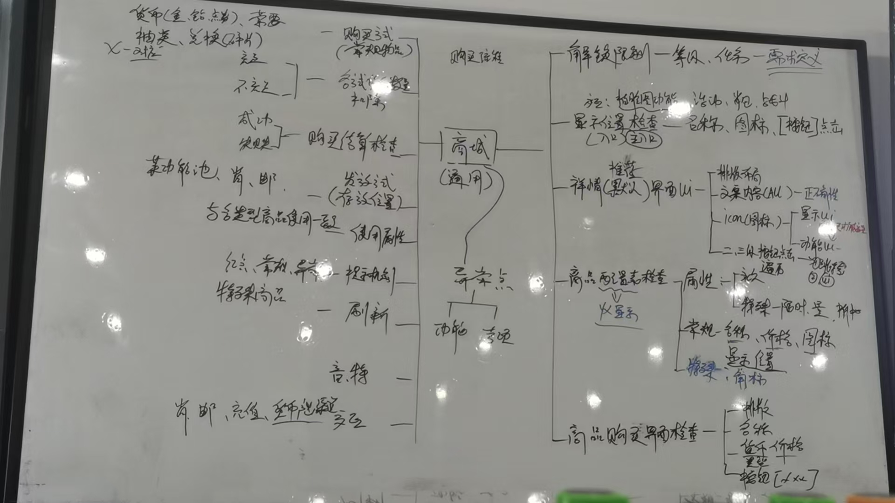

> [!IMPORTANT]
>
> 1.一切未知的地方都存在风险                             2.一切和需求不符合的都是BUG                      3.破坏性测试思维

# 安全

## 一、信息安全

1. 信息（账号、项目资料、验证）不能外传。
2. 不能携带（存储设备、私人电脑、设备）
3. 不允许拍照
4. 不允许透露薪资架构（保密协议）
5. 腾讯福利不允许变现：
   - 测试账号（Q币、Q点）点券
   - 腾讯发给你的私人账号货币福利变现
   - 不能在外网服务器暴露自己是测试人员

## 二、黑产

### 1、木马

开发-》分销-》挂马出信-》洗信出马

钓鱼链接

捆绑木马软件

APK（安卓），IPA（平果），（Windows）EXE

### 2、开挂

开发外挂、修改（数据）

1. 截获客户端发给服务器得数据包，修改后发送
2. 截获服务端发给客户端得数据包，修改后发送
3. 修改客户端内存
4. 服务器数据（黑客攻击 ）
5. 修改客户端配置文件

网络封包挂:实用工具，修改或模拟服务器端或客户端发出的数据包来实现的外挂

客户端挂，目标是游戏客户端（包括客户端得操作系统），一般通过增删改的方式实现，工具有调试工具（ollydbg）,反编译工具（IDA） 内存查看工具（cheatEngine）。需要对游戏引擎，游戏逻辑，操作系统有所了解。

内存挂：修改客户端运行时内存的外挂

客户端挂：修改客户端的配置文件的外挂


> [!IMPORTANT]
>
> 常见的游戏引擎有：
>
> 主流中很常用的游戏引擎分别为，ue4，unity，起源，cocos，jaya，egret，在国内其中unity、ue4占比最多，其次是cocos，再者是laya和egret。
>
> 游戏引擎与使用的语言：
>
> 

> [!IMPORTANT]
>
> 游戏渲染？？？？

### 3、代练

影响游戏平衡和玩家体验

### 4、演员

影响游戏平衡和玩家体验

## 三、违规信息安全

涉黄（模型，外观，动作，语言，文字，图片），暴力（血腥，动作，文字），涉政（党政军），欺诈，赌博，宗教，敏感词（脏话）

# 游戏评测

## 游戏美术


## 系统相关


## 体验相关


> [!NOTE]
>
> 问：**当后面一个部分和前面的有交集的时候是否需要全部重新测试**？
>
> 回答：不需要，沟通后备注由谁来测试

# 游戏测试

## 1、定义：

- 2个保证：保证正常运行（安装、解析、运行、卸载）和保证版本质量（功能可用、弱网质量、兼容性质量、中断质量 、安全质量）
- 2个建议：保证易用性（提示和引导）和可玩性（探索性，内容和美术）

## 2、游戏测试的理解：

1. 游戏是一种特殊的软件，游戏测试的一部分内容和软件测试相同，但又有自己的特殊性。
2. 游戏测试的一部分内容和软件测试相同，但又有自己的特殊性。游戏需要软件工程知识，也需要专业的游戏测试（可玩性，美术效果，策划合理性）
3. 游戏测试要求测试人员具备极大耐心、恒心、细心，因为一些bug会让游戏出现致命影响）

## 3、测试组成


### 1、 传统软件测试

1. 测试目的:发现软件中的缺陷
2. 测试依据：需求/产品规格说明书
3. 每一种测试都需要产品运行在真实（正式服、白名单账号）或是模拟（测试服）环境之下
4. 每一种测试都要求以系统方法展示产品功能（测试点、测试用例），执行记录证明测试结果是否有效（用例执行记录），提交发现其中出错的原因（Bug单）让程序人员进行改造。

### 2、游戏本身的测试

#### 	a、游戏测试的特性

1. 游戏情节的测试：游戏任务系统的组成，即游戏的事件驱动
2. 游戏平衡的测试：经济平衡，能力平衡（包括技能、属性、种族、装备、经济系统等），保证游戏世界竞争公平性
3. 游戏文化的测试（不一定）：游戏风格是中国主导还是日韩风主导（从NPC设定到游戏整体世界观）。

#### 	b、游戏的可玩性测试

游戏世界的搭建，保证游戏的可玩性。

## 4、游戏测试和软件测试的区别


## 5、测试工具


> [!NOTE]
>
> 角色三C是什么？
>
> 答：在游戏设计和开发中，“角色三C”通常指的是以下三种主要角色：
>
> 1. **C（Character，角色）**：指的是游戏中的人物角色。这个角色可以是玩家控制的主角，也可以是游戏世界中的非玩家角色（NPC）。角色的设计通常涉及其背景故事、个性特征、能力、外观以及在游戏中的作用。好的角色设计能增加玩家的代入感和游戏的沉浸感。
> 2. **C（Camera，镜头）**：指的是游戏中的视角或镜头系统。镜头是玩家与游戏世界互动的窗口，设计良好的镜头可以提升游戏的可玩性和视觉体验。例如，镜头的运动、视角的变化、以及与角色的同步性都非常重要，能影响玩家的游戏体验。
> 3. **C（Control，控制）**：指的是玩家与游戏的互动方式，即控制系统。控制系统设计需要保证玩家操作的流畅性和准确性。无论是通过键盘、鼠标、手柄、触屏，控制系统都需要易于上手并能够支持游戏的玩法需求。
>
> 这三个“C”概念常常在游戏设计过程中相互交织，影响着游戏的整体体验：
>
> - **角色（Character）**决定了玩家的代入感和情感联系。
> - **镜头（Camera）**影响了玩家的视觉体验和对环境的感知。
> - **控制（Control）**则是游戏操作的核心，确保玩家能顺利地与游戏世界互动。
>
> 设计团队通常会平衡这三方面，以确保游戏既有深度又能提供良好的用户体验。如果你在做游戏设计或者相关的开发，理解并优化这三个方面是提升游戏质量的重要步骤。

## 6、玩家的期望

1. 对操作的希望：一致性
2. 对目标的期望：明确的指导
3. 对界面的希望：体贴、友好
4. 对感觉的希望，沉浸
5. 对规则的期望：逻辑

> [!IMPORTANT]
>
> 一切与需求不符的都是bug,比如标点符号、多音字（细心）

## 7、游戏的分类

端游、手游、页游、H5游戏

1. **角色扮演游戏（Role-Playing Game, RPG）**

**介绍**：玩家通过扮演角色，探索虚拟世界，完成任务并提升角色能力，通常伴随深度剧情和开放性玩法。

1. 端游：《巫师3：狂猎》《上古卷轴5：天际》《博德之门3》
2. 手游：《原神》《崩坏：星穹铁道》《放置奇兵》

------

2. **动作游戏（Action Game, ACT）**

**介绍**：以玩家的反应速度、操作能力为核心，包含战斗、跳跃和解谜等内容。

- 端游：《战神》系列《鬼泣5》《只狼：影逝二度》
- 手游：《影之刃3》《帕斯卡契约》《忍者必须死3》

------

3. **第一人称射击游戏（First-Person Shooter, FPS）**

**介绍**：玩家以第一人称视角体验射击和战斗，通常注重战术协作和精确射击。

- 端游：《使命召唤：现代战争》《CS:GO》《Apex英雄》
- 手游：《和平精英》《使命召唤手游》《穿越火线：枪战王者》

------

4. **即时战略游戏（Real-Time Strategy, RTS）**

**介绍**：玩家实时管理资源、建设基地、指挥军队，考验战略部署能力。

- 端游：《星际争霸2》《帝国时代4》《魔兽争霸3》
- 手游：《红警OL》《战争艺术：赤潮》《王国纪元》

------

5. **大型多人在线角色扮演游戏（Massively Multiplayer Online Role-Playing Game, MMORPG）**

**介绍**：玩家在一个大型共享世界中进行冒险，强调社交、任务和团队合作。

- 端游：《魔兽世界》《最终幻想14》《黑色沙漠》
- 手游：《天涯明月刀手游》《龙之谷2》《剑网3：指尖江湖》

------

6. **沙盒游戏（Sandbox Game, Sandbox）**

**介绍**：提供开放的世界，玩家可以自由探索、建造和创造，而不受任务限制。

- 端游：《我的世界》《方舟：生存进化》《泰拉瑞亚》
- 手游：《迷你世界》《创造与魔法》《ROBLOX》

------

7. **冒险游戏（Adventure Game, AVG）**

**介绍**：注重故事和世界探索，通常包含解谜和互动对话元素。

- 端游：《奇异人生》《古墓丽影》系列《塞尔达传说：旷野之息》
- 手游：《迷室》系列《未定事件簿》《暖雪》

------

8. **生存游戏（Survival Game）**

**介绍**：玩家需要在恶劣环境中收集资源、建造设施，并对抗敌人或环境威胁。

- 端游：《森林》《七日杀》《Rust》
- 手游：《明日之后》《辐射：避难所》《荒野行动》

------

9. **塔防游戏（Tower Defense, TD）**

**介绍**：玩家通过建造防御塔阻止敌人到达目标，注重策略性。

- 端游：《植物大战僵尸》《保卫萝卜》《王国保卫战》
- 手游：《植物大战僵尸2》《王国保卫战》手游版《Bloons TD6》

------

10. **解谜游戏（Puzzle Game）**

**介绍**：以逻辑思考、观察能力和创造性解谜为核心玩法。

- 端游：《纪念碑谷》《The Witness》《Portal 2》
- 手游：《纪念碑谷2》《糖果传奇》《脑洞大师》

------

11. **竞速游戏（Racing Game, RCG）**

**介绍**：玩家通过操控车辆进行比赛，注重速度和操控技巧。

- 端游：《极品飞车》系列《地平线：零之曙光》《尘埃》系列
- 手游：《QQ飞车手游》《狂野飙车9》《极限竞速：街头传奇》

------

12. **卡牌游戏（Card Game, CCG/TCG）**

**介绍**：玩家通过收集和使用卡牌进行战斗或解谜。

- 端游：《炉石传说》《昆特牌》《影之诗》
- 手游：《炉石传说》手游版《影之诗》手游版《三国杀移动版》

------

13. **格斗游戏（Fighting Game, FTG）**

**介绍**：玩家操控角色进行一对一或多对多的近身战斗。

- 端游：《街头霸王》系列《拳皇》系列《真人快打》系列
- 手游：《拳皇命运》《街霸：对决》《火影忍者：疾风传》

------

14. **模拟经营游戏（Simulation Game, SIM）**

**介绍**：玩家管理某种系统（如城市、农场或人生），强调规划与资源管理。

- 端游：《模拟人生》系列《文明6》《城市：天际线》
- 手游：《梦幻花园》《模拟城市：我是市长》《部落冲突》

------

15. **音乐节奏游戏（Music/Rhythm Game）**

**介绍**：玩家通过按键或触摸与音乐节奏互动。

- 端游：《DJMAX RESPECT》《节奏地牢》《OSU!》
- 手游：《节奏大师》《Cytus II》《古树旋律（Deemo）》

# 测试流程

## 测试类型


功能 冒烟 随机 黑盒 全量 白盒 灰盒 回归 验收 探索 压力 性能 兼容性 边界条件 逆向负载 稳定性 接口 自动化 UI测试 安全 本地化 单元 集成 系统 验收 扩展性

## 测试职责

1. 功能测试:：保证游戏各功能运行正常，与需求一致
2. 可玩性
3. 尽早介入**（尽早熟悉项目进度）**，尽快完成**（熟悉项目内容，完成产物产出，发现BUG，推进BUG修复）**，持续不断**（测试过程反复不断）**
4. 玩家立场评测

## 开发流程

市场=》策划=》开发=》运营=》市场


## 测试流程

1. 开始
2. 需求分析
3. 需求评审
4. 测试计划制定
5. 提取测试点
6. 编写测试用例
7. 用例评审
8. 测试前准备
9. 冒烟测试
10. 执行测试用例
11. BUG提交
12. BUG跟踪
13. BUG回归
14. 最终包全量测试
15. 编写测试总结
16. 汇报测试报告
17. 结束

## 新版本测试执行策略

完整=》随机=》回归=》发布=》冒烟=》完整

## 游戏生明周期

1. 立项
2. 首版
3. 技术封测（内部测试或研发测试）
4. 删档内测（ACC 数据）
5. 不删档内测（保留账号/密码）
6. .公测 ->（不开放充值商业化功能，保留数据）
7. 正式上线（申请版号 ，19 年新政策）
8. 产品下线

# 需求分析

## 需求分析-评审

- **分析**：验证需求正确性、完整性、无二义性
- **评审**：沟通、质疑和确认需求内容，以及开发人员确认需求是否可以开发，测试人员确认开发的实现方式
- **人员**：策划、开发、测试
- **产出**：新版本需求文档

## 需求分析的范围

1. 需求背景、目标、影响范围（交互模块）
2. 提示方式，异常处理方式
3. 主流程、操作流程和步骤说明是否合理
4. 需求上下文的一致性，是否与其他需求发生冲突（**例如是否有死锁的情况**）
5. 需求的逻辑是否足够清晰，每个条款是否都包含描述问题和解决问题
6. 挖掘隐形需求和相互依赖的需求（**前置条件是否有清晰的说明**）

## 需求分析的目的

熟悉需求内容（主干、分支、异常），把不明确、疑问、隐形需求在本地记录下来

## 需求分析方法

### 一、全局观考虑

1. 了解需求主要目的，了解功能业务流程，硬件环境，软件环境，交互模块等
2. 分析需求中的疑问及问题，包括但不限于时间限制、奖励方式、步骤顺序、用户操作场景
3. 列出需求中不合理、不合逻辑、不能实施、存在歧义或含义不明确的语句
4. 挖掘隐藏需求（如活动次数、角色关系、系统与系统之间的关系）

### 二、业务流程分析

1. 画流程，检查流程图合理性、准确性等问题
2. 检查分支流程、用户权限说明、规则和边界值是否缺失
3. 检查是否存在异常分支、不确定范围
4. 流程图列出每个阶段测试点

### 三、补充测试点

1. 补充测试点，比如UI测试点，进入方式等
2. 探索式测试方法补充测试点
3. 对需求中的疑问和测试范围进行**再次确认**

### 需求分析方法（贯口）

- **疑问插批注**
- **数字找边界**
- **时间问刷新**
- **交易“重”到账**
- **任务画流程图**

# 测试计划制定

测试主管/组长分配组员任务，评估时间点

# 测试点

## 背包测试点


## 商城测试点



## 亲密度测试点


### 亲密度需求文档链接如下：

> **[需求原文链接](https://bob-mou.github.io/docs/Document/亲密度系统.docx)**              **[需求原文本地链接](./Document/亲密度系统.docx)**

## 好友测试点


## 技能测试点


## 枪械测试点


## 载具测试点


## 跳伞测试点


## 副本测试点


## 活动测试点


**火影应援需求文档链接如下**：

> **[需求原文链接](https://bob-mou.github.io/docs/Document/火影应援活动需求.docx)**          	**[需求原文本地链接](./Document/火影应援活动需求.docx)**

# 测试用例

## 概念

是为了测试目的（需求/功能）而编写的一组测试条件、测试输入、以及预期结果，已便测试程序路径的或核实是否满足某个特定需求

## 八大要素（TX七大要素）

1. 用例编号
2. 所属模块
3. 用例描述
4. 前提条件
5. 操作步骤
6. 预期结果
7. 备注
8. 优先级

## 用例的种类

1. 全功能测试：涵盖全部的测试对象的全部功能测试用例
2. 通用用例：不同模块的的通用功能的测试用例
3. 最小检查点：容易出BUG 的点
4. 冒烟用例：重点功能测试用例
5. 专项用例：性能、弱网、兼容

## 用例设计方法

### 一、等价类划分法

少量代表性测试数据，即可取得比较好的测试结果。等价划分分为有效等价和无效等价。有效等价类：对规格说明是合理的，有意义的输入数据构成的集合。

举例;

1.输入值判定，如，玩家昵称(要求 3-9 位中文），有效：中文、3-9 位，无效：其他类型文字、值<3

2.功能判定，如角色装备穿戴、攻击目标判定、释放范围判定、商品物品货币出售类型判定。

### 二、边界值划分法

对输入和输出的边界值进行测试的一种黑盒测试方法。

实例: X取值$x \in \mathbb{(3,20)}$，测试用例6条,{2,3,4,19,20,21}

### 三、错误推断法

基于经验和直觉推测程序可能出现的错误，通常是利用异常操作来推断错误

### 四、判定表法

判定表法分析和表达多逻辑条件线下的执行不同操作。

1. 条件桩(condition stub)
2. 动作桩(action  stub)
3. 条件项(condition Entry)
4. 动作项(action Entry)

### 五、场景设计法

通过使用“场景”对软件系统的功能点或业务流程进行描述的方法，包括**基本流和备选流**。常用UML用例设计方法。需要覆盖用例的主要成功场景和扩展场景，并且补充适当的正反卖弄测试用例和考虑异常的操作出现。

## 测试用例

### 实例：好友模块


## 用例评审

### 1.组内评审

测试组员编辑测试用例，其他组员提出问题和建议（评审时标记），修改优化后的测试用例输出大群（测试、开发、策划）查看。用例编写完成后，用例上传归档。

### 2.三方评审

测试组（所有人用例编写完成后）与开发策划协商时间点，测试主导会议，会议中提出问题和建议（评审时标记），修改优化后的测试用例输出大群（测试、开发、策划）查看。用例编写完成后，用例上传归档。

> [!IMPORTANT]
>
> **问题：用例一定要经过测试、开发的评审后才能执行吗？**
>
> **回答：实际情况不一定，但尽可能让组长等人知道你在执行**

# 测试前准备

测试账号：项目组提供，自己注册，账号是否需要添加白名单（项目组要求）

测试设备：功能测试，中高端机器，安卓，ios，鸿蒙,

测试网络：测试组专用WIFI，网络IP是否添加白名单

测试资源准备:SVN，沟通群下载，云盘下载

1.测试包获取，测试包版本核对-》安装

2.道具准备、配置表资源获取

3.GM工具获取

# 冒烟测试

1. 主功能冒烟：针对已经实现的功能进行验证，验证是否有入口且正确
2.  全量冒烟：针对已经实现的功能进行验证，验证功能入口，以及所有的分支和执行流程正确
3. 冒烟用例：提取全部功能的用例的5%，去执行。

1. 

# BUG表单


## 要素（以禅道为例）

1. 标题:[平台]（安卓 OR IOS）简要描述BUG的情况
2. 测试环境概述：硬件平台 操作系统 网络环境 账号
3. 复现步骤：1.   2.    3.   4.    5.  
4. 复现概率：必现、偶现、
5. 实际现象：BUG结果、游戏崩溃
6. 严重程度：**致命、严重、一般、轻微**
7. 优先级：**紧急、高、中、低**
8. 指派人：BUG解决者（开发/策划）
9. 附件：视频、图标、Log日志

### 不同平台的严重程度分类：

1. A 禅道：致命、严重、一般、轻微
2. BTAPD:致命、严重、一般、提示、建议
3. CJIRA:S、A、B、C、Q

### 不同平台的优先级分类：

1. A 禅道：紧急、高、中、低
2. BTAPD:紧急、高、中、低、无关紧要
3. CJIRA:紧急、高、中、低、无关紧要

### BUG严重程度

1. 致命：闪退、卡死、崩溃、和软货币相关

2. 严重：功能无响应、功能错误、数据错误、违规信息

3. 一般：UI错误、音效

4. 轻微：语法错误、文字错误、建议相关


### 修复优先级：

1. 紧急：完全卡进度、立即修复
2. 高：卡部分进度、尽快修复
3. 中：不卡进度、本版本修复
4. 低：可不修复（本版本）

# BUG执行


## 执行结果：

1. Pass:P(大写、加粗、绿色字体）-通过
2. Fail:F(大写、加粗、红色字体）-不通过
3. N/A（大写、加粗、黑色字体）-未实现

## Bug 状态流转（生命周期流转）


## 提交BUG单


## 印象深刻的BUG（口诉）


BUG技能命中野怪后（强控无伤害）没有触发仇恨机制

修复，控制技能加一点伤害

## BUG种类

1. 文字描述类BUG：标签页、标签页中的时间显示、文字描述、礼包详情等等
2. 实际和需求不一致的BUG：比如文字和文档不符合，奖励和文档不符合，奖励数量和需求不符合、图片、按钮显示位置和文档不符合等
3. UI类BUG：文字显示格式、图片、图片重叠、显示和内容不一致
4. 功能操作类BUG：功能阻碍、操作后和预期不符合、卡顿

## BUG问题相关


1.测试时发现一个已关闭的 Bug,后续版本测试时又复现了，该如何处理？

首先排查 bug 的关闭原因，若误关闭的话，与开发进行良好的沟通后重新打开 bug；如若正常关闭的话，分析 bug 单中内容是否与之前一致，一致的话就在原有的 bug 单增加新附件、内容、版本号后重新打开 bug,不一致的话就提交新的 bug 单。

2.如果发现一个偶现的 Bug，你会怎么处理？

第一时间保留 bug 相关信息，尝试多次复现，还是不能复现的话,发组内成员多人复现，还是不行的话，第一时间记录信息提交 bug 单并配合开发定位复现，验证时询问开发复现步骤，并多次验证，在后续版本中持续关注。3.你提交的 Bug，开发拒绝你的 Bug 单，你会怎么做？先查看，后沟通，测试主导，实在不行上报组长

4.如果你负责的版本内容，在版本发布后，收到外网玩家投诉，你会怎么做？

收到外网玩家问题后尝试进行复现，不能复现的话，让客服与玩家沟通获取更多详细信息，如果可以复现的话，第一时间提交 bug 单，群内进行评估；程度严重立即紧急修复，程度不严重后续版本修复，整个测试过程中要持续关注、配合；内网可以复现的话，就属于漏测，分析错误原因，整改优化用例，待定。

5.如果你发现你的同事测试的内容有 Bug，你会怎么做?

6.如果同事请假，你按照同事写的用例执行发现 Bug，你会怎么做？

# 测试工具

## adb（记录测试结果）

常用命令

```
adb logcat --help 帮助
```

1.设备连接

确定硬件状态正常（包括Android设备处于正常开机状态，USB连接线和各种接口完好）。
Android设备的开发者选项和USB调试模式已经开启（在[设置]-[开发者选项]-[USB调试]打开USB调试）。
确认设备驱动状态正常（安装ADB驱动程序）。
通过USB线连接点好和设备后确认状态。
通过adb devices命令查看设备连接情况。

2.logcat抓取日志

```
adb logcat -v  time >D:ceshilog.log
adb logcat -v  time >E:logs\ceshilog.log
使用-v选项设置日志的输出格式。例如，adb logcat -v time会以时间格式显示日志。
```

3.shell 命令

```
adb shell 进入shell模式
pm list package  //使用包管理器寻找包含fun的包
```

4.随机事件模拟

```
adb shell monkey -p fun.bantong.fish.c -v 100000 >D:随机测试.log
```

5.adb 安装软件

```
adb install  软件包地址
比如：
adb install E:\fun.bantong.fish.apk
```

## 过滤日志输出

日志消息的标记是一个简短的字符串，指示消息所源自的系统组件。例如，“View”表示视图系统。

优先级是以下字符值之一（按照从最低到最高优先级的顺序排列）：

- `V`：详细（最低优先级）
- `D`：调试
- `I`：信息
- `W`：警告
- `E`：错误
- `F`：严重错误
- `S`：静默（最高优先级，绝不会输出任何内容）

1. 按标签过滤

   使用`-s`选项指定要过滤的日志标签。例如，`adb logcat -s ActivityManager`只会打印TAG为ActivityManager的日志。

2. 按级别过滤使用`*:E`等形式的过滤器来指定日志级别。例如，`adb logcat *:E`只会打印级别为Error的日志。

3. 使用grep过滤

   可以通过管道将`adb logcat`的输出传递给`grep`命令进行正则表达式过滤。例如，`adb logcat | grep MyApp`只会输出包含“MyApp”字符串的日志行。

4. 按进程ID过滤

   使用`--pid=`选项指定要过滤的进程ID。例如，`adb logcat --pid=12345`只会打印进程号为12345的日志。

5. 日志级别来过滤日志输出

使用adb logcat命令时，可以通过指定日志级别来过滤日志输出。例如：

1. **打印所有级别的日志**（默认情况）：

   ```bash
   adb logcat
   ```

2. **打印级别为Verbose及以上的日志**：
   由于Verbose是默认级别，因此不需要特别指定。但可以通过指定其他级别来间接实现，例如只打印Error级别及以上的日志后再恢复为Verbose级别（通常不这么做，因为直接打印所有级别更常见）。

3. **打印级别为Debug及以上的日志**：
   实际上，adb logcat命令没有直接提供只打印Debug级别及以上的选项。但可以通过不指定级别（即默认打印所有级别）或使用更高级别的过滤器（如Error）后再结合其他方法（如grep）来间接筛选Debug级别的日志。不过，通常开发者会关心特定标签的Debug日志，因此更常用的是按标签和级别组合过滤。

4. **打印级别为Info及以上的日志**：
   同样地，adb logcat命令没有直接提供只打印Info级别及以上的选项。但可以通过不指定级别或使用更高级别的过滤器来间接实现。

5. **打印级别为Warn及以上的日志**：

   ```bash
   adb logcat *:W
   ```

   这里的`*:W`表示所有标签（`*`）的日志级别为Warn（`W`）及以上。

6. **打印级别为Error及以上的日志**：

   ```bash
   adb logcat *:E
   ```

   这里的`*:E`表示所有标签的日志级别为Error（`E`）及以上。

7. **打印级别为Fatal/Assert的日志**：
   Fatal级别通常与程序崩溃相关，而Assert级别用于断言失败时。由于Fatal级别较为特殊且通常与程序崩溃紧密相关，因此在实际使用中可能更关注Error级别及以上的日志来间接包含Fatal级别的日志（因为Fatal级别在Error级别之上）。对于Assert级别，则可以通过指定特定标签和级别的组合来过滤。

**[ADB常用调试命令文档](https://bob-mou.github.io/docs/Document/Android调试常用命令.docx)**  

## perfdog（性能测试）

性能测试，腾讯收费软件

## solox（性能测试）

性能测试，一个仿perfdog程序

python -m solox （默认）

## GM工具

常用GM命令（腾讯某游戏命令）

1. $clearmail
2. $clearbag
3. $kill
4. $item 153344  X
5. $openPvb
6. $dairlyTaskFinish

用途:便捷测试，修改对应游戏数据

方式：插件、游戏内按钮、网页、聊天框输入指令

入口：手势指令（和平精英）、大厅输入指令、游戏按钮

分类：前台GM  服务器GM

内容：前台GM:调试AI行为、获取物品、修改经验、等级、任务进度一键完成、战力修改 

服务器GM：服务器修改时间、重启

道具表：道具ID、名称、图片获取地址、道具介绍、最低获取等级

配置表：

商品配置表：ID、商品名称、价格、货币、排序、位置、购买限制、货币种类、折扣、折扣时间、上架时间、下架时间、图标资源路径、是否允许索要、购买成功后是否可以立即穿戴、每日限购数量、每周限购数量

任务配置表：任务ID、名称、任务介绍、任务时间

活动配置表：活动ID 、活动时间、活动奖励介绍、活动介绍

# 概率测试：

1. 核对查看概率配置和游戏中的数据显示,目的：概率表与游戏显示是否一致（配置道具和道具概率）
2. 查看物品配置权重（道具：高、中、低品质），目的：核对道具权重和是否合理
3. 尝试多次测试，进行记录，查看结果（高概率可以测试出来，低概率不能测试出来）

概率测试常规方法：多次抽取，GM工具调试进行抽取，自动化工具测试抽取

低概率测试方式：更改配置表

1. 将低概率修改为高概率，0.0001%修改为100%，再改为20%，奖励表总概率为1
2. 恢复数值，继续多次验证结果，刷新

英雄技能测试注意点

英雄技能测试的时候，测试技能在时间非常充足的时候，技能尽可能的和其他全部英雄进行交互测试。在时间充足的时候，选取其中有代表性的英雄进行测试。

# 排序测试

品质：橙>紫蓝白灰

武器：武器，佩饰，防具，消耗

等级：高等级，低等级

时间：大类、武器、等级、时间

控制变量法测试：

1.测试品质：武器，等级，时间不变化，品质变化

# 伤害数值测试

1. 核对角色伤害配置（伤害成长公式），与实际的伤害显示数值对比是否一致   备注：不考虑任何加成表现
2. 实际的地图AI进行交互，查看AI头顶数据显示/血量扣除数值
3. 交互，与伤害加成功能进行交互，查看交互公式（装备穿戴，铭文穿戴，BuFF加成）（继续按：1.2步骤进行测试）
4. 验证更加精准的话，借助开发者工具（战斗日志）进行手机查看

# 测试服务器

01服务器，02测试服

01开发服务器、02开发服务器

策划服务器


# 弹道指示器

可以通过弹道指示器测试弹道分布，弹道下坠轨迹，弹道后坐力


新手引导时候，获取奖励时强制退出游戏可以重新进入新手引导并获得新手奖励

从而实现无限刷取奖励


好友上限BUG

好友上限300，黑名单上限300。299好友当好友拉黑后，加新的好友后恢复好友，好友数为301。

 

任务系统

主线任务挑战某一个任务，任务需求20-30级别，但是玩家通过其他方式达到了31级别

任务提前完成了后面一个等级阶段的任务，并且可以直接领取，没有设置领取限制，必须先完成前面一个阶段才能完成后面一个任务的内容


# 测试总结与报告

项目名称《》

版本号：

测试类型：

一、测试环境概述：硬件、系统、时间、人员

二、BUG 概述：XXX 版本新增 XXX 个，致命 XXX 个，严重，一般，轻微

三、测试模板：XXX\XXX

四、测试结果（插入用例执行结束）

发布标准

# 专项测试

> [!NOTE]
>
> 问：专项测试是在什么时候进行测试的？
>
> 回答：专项测试是在功能测试结束

> [!IMPORTANT]
>
> 问：冒烟测试是在什么时候进行测试的？
>
> 回答：冒烟测试是在每次获得新的安装包的时候，都需要进行冒烟测试

## 专项测试类型

中断、兼容性、性能、弱网、安全等

## 1、中断：

### 定义：

测试程序在遭遇意外中断时的响应能力与稳定性

### 常见的中断：

常见中断：媒体（音乐）、提醒（iOS）、锁屏解锁、照相按钮、短信、来电、通话挂断、手机语音、数据线插拔、充电、WIFI连接提醒、蓝牙提醒、低电量运行、闹钟等

网络终端：2G、3G、4G、5G、飞行模式、丢包、DNS高延迟、网络高抖动、误码

暴力测试：拔电池、杀进程、关机、重启、长时间使用、存储卡插拔、软件搬家（存储转移）、前后台切换

## 2、兼容性：


定义：兼容性测试是指对所设计的软件的在软件与硬件、软件之间的兼容性的测试，兼容性测试是指软件测试在特定的硬件平台上、不同的应用程序之间、不同的操作系统上不同网络环境等情况下能够很友好的运行测试。

硬件、操作系统、屏幕、分辨率

### 测试方法：

web测试和app测试

1. 全手工人工测试
2. 第三方家兼容性工具测试

优缺点：全人工测试，工作量大，覆盖不全；第三方兼容性工具测试，工作量小，主功能和主流程测试没有侧重点。两者结合才是最好的测试方法。

### 测试流程：

1. 接取需求任务：注意事项，测试内容说明，测试重点说明，测试设备要求说明
2. 获取测试资源文档：适配测试用例，Top设备列表，GM工具获取，测试包获取
3. 执行适配测试并提交适配问题
4. 提交测试结果和测试问题，汇总给组长

### 适配性测试时间点：

1. 游戏已封包且功能完善，即可进行适配测试
2. 新增功能，设计界面比较多（大版本更新）

> [!WARNING]
>
> 问：GPU是如何渲染游戏的？？
>
> 回答：

### 适配性测试需求：

各个功能重点关注点：

昵称使用最长昵称，

萌新账号过新手任务

第一人称

战斗场景

表情包系统

新增信号枪，gm指令添加106007进行测试

### 兼容性BUG:

1. GPU渲染机制
2. 文字和UI重叠、遮挡、出框
3. 闪退

## 3、弱网:

### 定义和目的

定义：通过弱网工具设置不同的网络损伤，模拟实际用户场景下的不同流量以及丢包率的损伤模型。

目的：确保游戏在弱网或无网环境下的正常运行，避免卡死、闪退、崩溃现象，确保弱网提示机制的正常触发，局外的常规提示网络差、加载中，图标信号提示触发，局内的断线重连机制触发提示，恢复后数据的同步性、正确性、唯一性

### 弱网的提示机制的触发：

局外：常规提示，网络差，记载中；图标提示：信号质量（绿色、橙色、红色）

局内:断线重连，（同步性、正确性、唯一性）

### 重连后数据

同步性、唯一性、正确性

### 延迟和延时

- 延时：(客户端->服务器)一个端点到另一个端点所需时间
- 延迟：一个端点到另一个端点的往返时间（不包含客户端、服务器的处理时间）

### 弱网测试流程

1. 确定需求（弱网参数模型，测试场景）
2. 测试前准备(工具的安装、弱网参数的设定)
3. 测试进行，根据编写的测试用例，模拟弱网网络环境进行测试，记录测试结果
4. 测试完成，整理报告上报组长

**弱网节点**：某一个功能完成（未完成 100%)时测弱网

### 几种弱网环境参数


#### 2G弱网环境：

1. 上下行延迟：500/400
2. 上下行带宽：20/50

#### 3G弱网环境：

1. 上下行延迟：100/100 
2. 上下行带宽：330/2000

#### 3G网络高延时高抖动：

1. 上下行延时：333

2. 上下行抖动：900

3. 上下丢包率：8

4. 最大带宽：上：330kbps 下：2000kbps

#### 上行丢包：

1. 上行丢包80%

2. 上下行带宽：3400/4000

#### 下行丢包：

1. 下行丢包80%
2. 上下行带宽：3400/4000

#### 长时间断网状态：

1. 下行丢包100%

2. 上下行带宽：0

### 不同延迟的网络状态

如何定义网络延迟程度：（一般网络延迟[PING值](https://zhida.zhihu.com/search?content_id=627221255&content_type=Answer&match_order=1&q=PING值&zhida_source=entity)越低速度越快，但是速度与延迟没有必然联系）

1~30ms: 极快，几乎察觉不出有延迟，玩任何游戏速度都特别顺畅

31~50ms: 良好，可以正常游戏，没有明显的延迟情况

51~100ms: 普通， 对抗类游戏在一定水平以上能感觉出延迟，偶尔感觉到停顿

100ms~200ms: 较差，无法正常游玩对抗类游戏，有明显卡顿， 偶尔出现丢包和掉线现象

200ms~500ms：很差，访问网页有明显的延迟和卡顿，经常出现丢包或无法访问

\>500ms：极差，难以接受的延迟和丢包，甚至无法访问网页

\>1000ms：基本无法访问。

### 常见的弱网场景和解决方案

1.现象：应用数据下载中，因网速过慢点击取消并重新登录，数据初始化完成后出现重复 ，造成数据不一致。

原因：数据下载过程中，下载失败后，未进行数据回滚，中止后重新下载，出现数据重复

解决:使用事务处理数据下载，在下载失败后，本地数据进行数据回滚

2.现象：数据上传过程中，由于网络延迟或者网站阻塞的原因，触发重传机制或二次点击上传按钮，导致出现数据重复写入，形成脏数据

原因：数据上传中，由于失败重传机制，会出现连续两次写操作，并没作唯一性识别

解决:利用数据特性，对可能造成脏数据的地方，使用关键字段利用hash表作唯一性识别。

3.现象：弱网环境下的，用户输入用户账号和密码进行登录，应用连接超时时，返回用户名和密码错误提示

原因：弱网环境下的连接超时后，按照强业务逻辑处理，导致返回超时异常

解决:弱网连接超时后，提示连接超时

4.现象：弱网环境下，用户第一次输入后，并再次输入全新关键字并发送请求，等待结果过程中，当前的搜索结果被之前的搜索结果覆盖

原因：中间返回的数据比较慢，最终显示的时候之前的请求返回的数据覆盖了现有数据

解决:异步请求的未完成的数据不做处理

## 4、性能：

### 定义和目的

定义:通过自动化工具（perfdog）模拟多种正常、峰值、异常负载条件下（高中低端手机）对系统的各项指标（CPU、内存、温度、流量、FPS）的测试。

 目的:验证系统是否符合性能要求，提出系统优化建议，保证系统运行流畅、功耗符合预期

### 性能测试分类

1. 客户端性能
2. 服务器性能

### 性能测试流程(专职):

1. 接受性能需求（设备要求（设备基线）、性能指标/标准（内存消耗、cpu占用、网络延时、加载时间）、测试场景）
2. 设计性能场景用例
3. 搭建测试环境
4. 执行性能测试并收集数据
5. 汇总并提交数据对应人员
6. 分析数据，给出调优建议

### 性能测试流程(辅助):

1. 接受性能测试用例
2. 搭建测试环境
3. 执行性能测试并收集数据
4. 汇总并提交数据给组长

### 性能需求：

1. 硬件设备要求（安卓 IOS 低中高端机）
2. 测试场景(游戏加载场景、挂机场景、模块切换场景、对局并发场景（PVP  PVE）)
3. 性能指标
4. CPU占用
5. 内存消耗
6. FPS（高中低端游戏推荐配置的运行比如中端机:限制60帧不低于50FPS,限制30帧不低于25FPS）
7. 流量（单位时间消耗流量）
8. 温度（整机温度）

FPS无明显跳帧，无明显卡顿，响应无明显延迟，反复切换游戏场景、滑动页面，内存无明显增长，游戏测试不运行其他应用

### 测试注意事项

测试之前保证测试环境一致、数据一致

1. 手机电量充足、手机起始温度（小于35度(参考perfdog电池温度)）、锁定手机亮度
2. perfdog 勾选所有可选项，保证数据完整性
3. 开启测试之前，确保手机没有无关的APP进程
4. 每个关卡需要使用单独的标签区分开

### 测试用例：

1. 模块
2. 测试场景
3. 操作步骤
4. 测试时长
5. 测试目的

### 性能测试用例


| 测试场景   | 操作步骤                    | 测试时长 | 测试目的                                                     |
| :--------- | --------------------------- | -------- | ------------------------------------------------------------ |
| 挂机       | 进入游戏界面 ，不做任何操作 | 600s     | 保证游戏不做任何操作时，所有指标的数据平稳性，无异常数据表现 |
| 场景切换   | 点击不同场景的按钮          | 120s     | 反复加载游戏资源，关闭资源，查看内存是否有积压导致内存泄露   |
| 高负载场景 | PVE 或PVP进行高负载游戏对战 | 多次对局 | 游戏高并发场景的数据指标                                     |

### 2024年低中高端机型举例

1. 高端机：iQOO Neo8 高通晓龙 8+
2. 终端机：HUAWEI Mate 30 华为海思990
3. 低端机：小米 12  高通 骁龙778G

硬件设备（高端机型：苹果iPhone 15 Pro系列，华为Mate 60 Pro；中端机型：红米K60，OPPO Reno9；低端机型：红米Note 12），测试场景()，性能指标关注：1.CPU 2.内存消耗  3.FPS,4.流量，5.温度（整机温度≤37摄氏度）

### 性能需求分析

1. 定位需求类型，游戏大厅和直播类、活动类型、局外页签类、loading类型、对局类、道具类

2. 游戏大厅和直播类：这类注重挂机一段时间后查看内存、温度、帧数，根据底层架构不同，帧数不同，可能挂机状态下帧率有规律性波动，只要视觉和体感没有卡顿问题不大

3. 活动类型：注重活动页签切换和重复打开内存增长问题

4. 局外页签类：和活动类差不多，多注重重复打开和所有页签切换后的内存变化

5. loading类型：重复尝试加载取平均值

6. 对局类：这类需求比较重要，是客户端性能测试的核心，无论是帧数、卡顿、帧延迟、内存、CPU、GPU、温度、全部都需要重点注意

7. 道具类：枪械、皮肤、角色、注重第一第三视角使用时的性能数据，然后对比同类型的数据。

### 性能测试问题Q&A

1.性能测试流程?性能工具用的是?收费吗?

回答：流程：

- 接受性能测试用例
- 搭建测试环境
- 执行性能测试并收集数据
- 汇总并提交数据给组长

性能工具是perfdo;软件收费

2.性能测试指标关注哪些，标准是多少?

​	fps，cpu占用，Gpu占用，内存占用 

3.fps是什么?fps单位是什么?fps没有答到相应的值要怎么判断，影响它的因素?

​	每秒钟游戏的画面数量，单位是：帧；使用工具查看对应的值；影响因素有：fps，cpu占用，Gpu占用，内存占用，温度，网络

4.突然的掉帧原因?

​	cpu占用过高，Gpu占用过高，内存占用过高，温度过高，网络延迟，游戏系统BUG等问题

5.jank和掉帧的关系两者必然影响吗?

​	jank代表卡顿，（单词原来的意思是：不稳定，卡顿），关系是掉帧不一定卡顿，但是卡顿一定掉帧

6.内存泄露要怎么判断?内存的定义?

​	判断是：内存持续升高，定义：ROM和RAM，RAM：随机访问存储器 (Random Access Memory，易失性。ROM：只读存储器 (Read Only Memory)，非易失性。

7.帧耗时是什么?单位是什么?用来干嘛?帧耗时与帧率是什么关系?

​	帧耗时（Frame Time）是帧耗时指生成单帧图像所需的时间，从开始渲染到完全输出所消耗的时间总量。单位一般ms(毫秒)

8.测试性能是发现过哪些性能问题?什么原因导致的?

1. 使用枪皮肤释放技能掉帧=》原因是：资源加载导致内存
2. 击杀掉帧=》原因是：资源加载导致内存
3. 跳转页面卡顿=》原因是：资源加载导致内存
4. 游戏玩久了内存占用上升=》原因是：内存泄露

性能测试报告组长编写，我有看过。
包括版本号、测试时间、测试服、风险等级、测试类型、测试平台、测试结论

测试阶段有多少个服务器？ 
测试服（自命名test-01，备用test-02），cn性能，开发服，策划服，运营服，8001外网
性能bug:
安卓，击杀瞬间掉帧；10人比单人CPU上升10%；温度。


# 长期项目

## 项目分析案例

两款游戏（类型不要重复）并提前熟悉：
游戏类型：Moba、FPS、RPG、SLG、ACT、竞速、自走棋、开放性世界。
游戏公司：中型，游戏不要太火爆（排名），不能与腾讯有关系（不允许QQ、微信登录）

项目相关：人员结构，用例数量，版本周期

### 街头篮球

策划周期 3个月

开发周期 4个月

测开周期 8个月

- 版本周期

  1. 大版本：2个月 	1.2月出包测试  	测试周期14天
  2. 小版本：一周	周三给包	周三周四测试

- 人员组成

  ​            3测试       8开发      4产品和策划

- 用例数量

  ​	 80000+

### 我的勇者（预估）

策划周期 1个月

开发周期 3个月

测开周期 5个月

- 版本周期

  1. 大版本：2个月 	1.2月出包测试  	测试周期14天
  2. 小版本：一周	周三给包	周三周四测试

- 人员组成：预估23人

  ​            5测试       13开发      5产品和策划

- 用例数量

  ​	 80000+

### 交错战线（预估）

策划周期 1个月

开发周期 3个月

测开周期 5个月

- 版本周期

  1. 大版本：2个月 	1.2月出包测试  	测试周期14天
  2. 小版本：一周	周三给包	周三周四测试

- 人员组成：预估23人

  ​            5测试       13开发      5产品和策划

- 用例数量

  ​	 80000+

现在运营期间产出每月每人产出用例数：160/5=32条左右（预估）

## 项目选择过程

### **浮空秘境**

- [x] Tap Tap下载人数：400万

- [x] Tap Tap关注度：200万

- [x] 游戏安装包大小：700 MB

- [x] 游戏类型：冒险解谜类

- [x] 上线时间：2023

- [ ] 横板OR竖版：竖版=》》**NO**

- [x] 非腾讯旗下游戏：是

- [x] 国内开发团队：是

- [x] 游戏丰富度：OK

  最终判断：**NO**，横板

### **尘白禁区**

- [ ] Tap Tap下载人数：982万

- [ ] Tap Tap关注度：615万

- [x] 游戏安装包大小：746 MB

- [x] 游戏类型：二次元、动作、射击、TPS、美少女

- [x] 上线时间：2023-7-19

- [x] 横板OR竖版：横板OK

- [x] 非腾讯旗下游戏：是

- [x] 国内开发团队：西山居

- [x] 游戏丰富度：OK

  最终判断：NO，热度太火了

### **我的勇者**

- [x] Tap Tap下载人数：690万

- [x] Tap Tap关注度：411万

- [x] 游戏安装包大小：1020 MB

- [x] 游戏类型：像素\RPG\地牢\冒险

- [ ] 上线时间：2019-8

- [x] 横板OR竖版：横板OK

- [x] 非腾讯旗下游戏：是

- [x] 国内开发团队：魔力数娱

- [x] 游戏丰富度：OK

  最终判断：NO，发行太久了

### 	**解忧小村落**

- [x] Tap Tap下载人数：156万

- [x] Tap Tap关注度：127万

- [x] 游戏安装包大小：465 MB

- [x] 游戏类型：种田\国风\经营\休闲\模拟\养成

- [x] 上线时间：2023-1-8

- [x] 横板OR竖版：横板OK

- [x] 非腾讯旗下游戏：是

- [x] 国内开发团队：古德工作室（绍兴天石网络科技有限公司）

- [x] 游戏丰富度：OK

  最终判断：OK（备选）（同时担心内容太少了）

### **交错战线**

- [x] Tap Tap下载人数：234万

- [x] Tap Tap关注度：159万

- [x] 游戏安装包大小：1900 MB

- [x] 游戏类型：二次元\RPG\机甲\对战

- [x] 上线时间：2024-1-2

- [x] 横板OR竖版：横板OK

- [x] 非腾讯旗下游戏：是

- [x] 国内开发团队：广州米茄科技有限公司

- [x] 游戏丰富度：OK

  最终判断：OK，（上线刚一年）

## 公司背景调查

### 游戏开发厂商（交错战线）

**厂商名称**：广州米茄科技有限公司（简称“米茄游戏”）

**公司规模与实力**

- **人员规模**：公司参保人数为88人，实际人员规模可能在50~99人之间。
- **知识产权**：公司拥有多项知识产权，包括1个企业品牌项目、86个注册商标、3个专利信息和26个软件著作权。这些知识产权的拥有，表明公司具有较强的创新能力和技术实力。

**厂商简介**：

米茄游戏成立于2018年，是一家由二次元机甲爱好者组建的公司。公司主要以开发二次元机娘为核心的游戏，并致力于传播机娘文化。《交错战线》是米茄游戏的首款正式作品，凭借其出众的立绘和独特的游戏设定，吸引了大量玩家的关注。

### 游戏开发工作室

由于米茄游戏本身规模相对较小，且专注于二次元机娘游戏的开发，因此其内部可能并没有设立多个独立的工作室来分别负责不同项目的开发。不过，可以认为米茄游戏整个公司就是一个专注于《交错战线》等二次元机娘游戏开发的工作室。

**工作室规模**：相对较小，但拥有一支充满热情和创造力的开发团队。

**所在地**：广州市天河区。

**工作室旗下其他游戏**：

- 目前已知的主要作品是《交错战线》，这是米茄游戏的首款正式作品，也是他们围绕二次元机娘文化开发的一款科幻题材的机甲美少女游戏。

**游戏上线时间**：

- 《交错战线》于2024年1月3日正式公测，玩家可以在游戏中作为星系探索队的总队长，带领一众成员探索星系，并在过程中遭遇敌人、结识伙伴。


# 假期任务

## 1.假期寻找（两个项目）

《交错战线》 《我的勇者》价格

## 2.负责项目（7-10）模块

交错战线：

1. 好友 OK

2. 背包  OK

   添加 芯片素材 

3. 乌斯怀亚-123技能


我的勇者：

1. 商城
2. 大副本-050关测试用例
3. 活动

3.测试点（100%）用例（每个项目3个模块）

交错战线：

1. 好友 OK
2. 背包  
3. 乌斯怀亚-123技能

我的勇者：

1. 商城
2. 大副本-050关测试用例
3. 月签到活动

## 4.用例评审（）每个人参加>=1个模块

## 5.BUG(10个不用类型的Bug)（需要可以测试出来）

交错战线：

1. 【背包】【物品】物品排序检查，点击排序后排序不起作用

2. 【任务】系统红点，点击后不消失

# 面试

## 自我介绍：

面试官你好，我叫牟连波，毕业于中南民族大学信息管理与信息系统专业。

**我曾就职于广州米茄科技有限公司**，担任功能测试工程师，参与过《交错战线》、《星陨》这两个**项目**。这两个项目都属于、二次元机甲美少女题材的放置类手游，我负责模块商城、角色、技能、副本系统、好友、背包、签到任务和活动。**在项目中，我主要工作内容是**，参加需求评审，测试用例设计、编写用例、主持用例评审，执行测试，汇总BUG，跟踪BUG，我也做过z测试（如使用PerfDog监控性能指标）、弱网络环境模拟验证，并全程跟踪BUG修复。**测试工具方面**，我熟悉Jira（用例和BUG管理平台）、ADB，之前做过一段时间网页开发，也懂得一些MYSQL，linux的命令工具。

个人热爱游戏行业，希望未来能够在游戏测试这个行业发展。最近也在学习自动化脚本的内容。面试官你好，我的介绍就是这样，谢谢。

## 面试问题

### 对于Spring中IOC和AOP的理解。

在java面试中，如果我们被问及Spring框架的相关问题，那么一定避不开对Spring中的IOC和AOP的理解和使用，本文就简单谈论对于Spring中IOC和AOP的理解。

一、IOC的理解
1.1   IOC的概念与原理

        IOC，即控制反转，把对象的创建、初始化、销毁交给 Spring 来管理，而不是由开发者控制，实现控制反转。IOC 思想基于 IOC 容器完成，IOC 容器底层就是对象工厂（BeanFactory 接口）。IOC的原理是基于xml解析、工厂设计模式、反射实现的。使用IOC可以降低代码的耦合度。

1.2   Spring 提供 IOC 容器实现两种方式

（1）BeanFactory：IOC 容器基本实现，是 Spring 内部的使用接口，不提供开发人员进行使用。
在加载配置文件时候不会创建对象，在获取对象（使用）才去创建对象
（2）ApplicationContext：BeanFactory 接口的子接口，提供更多更强大的功能，一般由开发人
员进行使用。在加载配置文件时候就会把在配置文件对象进行创建
1.3   IOC 操作 Bean 管理
        IOC操作Bean管理有两种形式，一种是基于xml方式，另一种是基于注解方式。
        基于xml方式的Bean管理，Spring主要提供了<bean><property>等标签。
        基于注解方式的Bean管理，Spring主要提供了@Component  @Service  @Controller   @Repository等注解。
二、AOP的理解
2.1   AOP的概念

（1）AOP（面向切面编程），利用 AOP 可以对业务逻辑的各个部分进行隔离，从而使得
业务逻辑各部分之间的耦合度降低，提高程序的可重用性，同时提高了开发的效率。
（2）通俗来说，就是不通过修改源代码方式，在主干功能里面添加新功能。
2.2   AOP的底层原理

AOP底层是使用动态代理来实现的，这里有两种情况的动态代理：

① 有接口的情况，使用 JDK 动态代理
即创建接口实现类代理对象，增强类的方法。
② 没有接口的情况，使用 CGLIB 动态代理
即创建子类的代理对象，增强类的方法。
2.3   AOP的专业术语

① 连接点：类里面可以被增强的方法，这些方法被称为连接点。

② 切入点：实际被真正增强的方法，称为切入点。

③ 通知（增强）：（1）实际增强的逻辑部分称为通知（增强）

（2）通知有多种类型：前置通知、后置通知、环绕通知、异常通知、最终通知

④ 切面：把通知应用到切入点的过程，称为切面。

2.4   AOP的操作

① Spring 框架一般都是基于 AspectJ 实现 AOP 操作 ，AspectJ 不是 Spring 的组成部分，独立于 AOP 框架，一般把 AspectJ 和 Spirng 框架一起使用，进行 AOP 操作。
② 基于 AspectJ 实现 AOP 操作
（1）基于 xml 配置文件实现
（2）基于注解方式实现
③ 在项目中引入 AOP 的相关依赖，主要有：aop、cglib、aspectj、aopalliance等依赖。
④ 切入点表达式
（1）切入点表达式作用：明确对哪个类里面的哪个方法进行增强。
（2）语法结构： execution([权限修饰符] [返回类型] [类全路径] [方法名称]([参数列表]) )

### RBAC

1、RBAC是什么？
Role-Based Access Control，中文意思是：基于角色（Role）的访问控制。这是一种广泛应用于计算机系统和网络安全领域的访问控制模型。

简单来说，就是通过将权限分配给➡角色，再将角色分配给➡用户，来实现对系统资源的访问控制。一个用户拥有若干角色，每一个角色拥有若干权限。这样，就构造成“用户-角色-权限”的授权模型。在这种模型中，用户与角色之间，角色与权限之间，一般者是多对多的关系。具体而言，RBAC模型定义了以下几个核心概念：

角色（Role）：角色是指在系统中具有一组相关权限的抽象概念，代表了用户在特定上下文中的身份或职能，例如管理员、普通用户等。

权限（Permission）：权限是指对系统资源进行操作的许可，如读取、写入、修改等。权限可以被分配给角色。

用户（User）：用户是指系统的实际使用者，每个用户可以被分配一个或多个角色。

分配（Assignment）：分配是指将角色与用户关联起来，以赋予用户相应的权限。

RBAC 认为授权实际上是Who 、What 、How 三元组之间的关系，也就是Who 对What 进行How 的操作，也就是“主体”对“客体”的操作。

Who：是权限的拥有者或主体（如：User，Role）。

What：是操作或对象（operation，object）。

How：具体的权限（Privilege,正向授权与负向授权）。

通过RBAC模型，可以实现灵活且易于管理的访问控制策略。管理员可以通过分配和调整角色，来管理用户的权限。这种角色层次结构可以帮助简化权限管理，并确保用户只有所需的权限。

RBAC模型广泛应用于系统安全、数据库管理、网络管理等领域，它提供了一种可扩展、可管理的访问控制机制，有助于保护系统资源免受未经授权的访问和潜在的安全威胁。


1、自我介绍
问候、个人基本信息（姓名、年龄、籍贯）、学历情况（毕业时间、专业、学院）、工作经历【时长（参加工作的时间-结束时间、哪家公司)、参与项目介绍（项目名称、类型简单介绍）、个人爱好（游戏、学习、户外）、结束语】---自己组织语言。

2、项目介绍
项目名称、类型、玩法机制、负责模块、主工作内容、辅工作内容、结束语。

项目：交错战线


类型：RPG  回合制放置游戏

玩法机制：自己有九个格子，上边放自己选择的五个角色，对战其他的NPC和其他玩家。角色等级，装备是自己一点点培养和获取的。等级越高战力越高，就等通关更高等级的副本，就可以获取更多的材料和副本。

负责的模块：《交错战线》背包、角色编队、部分角色及技能、补给站(商城)、（重生之梦 02~04）主线剧情、基地（材

料生产）、寻觅归途（一周年活动）；《星陨》：好友、背包、部分角色及技能、（碎星探索）副本、商城

主工作内容：我主要工作内容是，参加需求评审，测试用例设计、编写用例、主持需求评审，执行测试，汇总BUG，跟踪BUG，并全程跟踪BUG修复

辅工作内容：我也参加过性能优化测试（如使用PerfDog监控性能指标）、弱网络环境模拟验证

2.1、公司在哪？简洁明了（区域、大楼）

广州天河区

广州米茄科技

大圣工业园 3栋17

广氮新村39栋5楼 1500

（深圳南山区）

2.2、你做了几个项目，那个项目熟悉一点？/最近做的是一个什么项目？

两个项目《交错战线》《星陨》

其实都还好挺熟悉的

2.3、你当时负责哪些测试？你的这个模块你简单的介绍一下？

项目模块就选《交错战线》一周年活动、04副本

2.4、你当时是怎么测试的呢？（测试点）

2.5、你这个项目上线了吗？什么时候上的？

上线时间：2024年2月1日

公测：2023年1月3日

上次更新是2025年12月25（大版本）（周年庆祝）

最近的大版本更新是（2月19更新的）

2.6、项目版本周期是怎么样的？(大小版本）

两个月一个大版本（停服更新）

一个月半是开发周，我们后面测试上周，一般是周五更新。

小版本是一个周一次更新（一般周四更新）（不停服更新）

2.7、你们项目人员的一个架构？（多少人）

一共是7个人测试，新项目这边：是3个人

开发那边的话24个人

策划和产品5个人

36人

## ## 2.8、你提交的Bug中有没有印象深刻的Bug？

再战斗前我们会选择角色，就在选择的时候发现角色拖不动，需要把游戏重启之后再进入才能拖动。连续页面切换，发生了比较严重的数据泄露，然后游戏就会选择的时候点击失效


1、【好友模块】但是好友列表是有上限的，当好友达到上限的时候，屏蔽好友，然后新加一个好友，然后好友解除屏蔽以后会回到好友列表，好友数量就突破上限了。 

2、【副本模块】 

掉落物问题 

3、【周年活动】达到成就领取奖励活动

完成了任务，任务奖励不可以领取

完成了任务，任务奖励一开始可以领取过段时间又不可以领取了。（BUG）

阶段任务，必须先解锁一阶段，再解锁二阶段的任务

4、【性能问题】

闪退、卡顿、掉帧

关注的参数：

CPU、内存、FPS、流量、温度

FPS:帧率图、Avg(FPS)、Low(FPS)、掉帧

CPU:占用图、平均占用

内存：占用图、内存变化（内存泄露）

流量：（场景）每十分钟使用量

温度:温度

5、【兼容性问题】

跑机子常用100,其中十几都有问题

6、【弱网问题】（重要数据交互）（游戏断线重连机制）

点击抽奖，上行断开（现象：点击后无响应），缺少断开连接提示

点击抽奖，下行断开（现象：点击后一直在转圈（背包中出现新物品）），缺少断开连接提示

打开宝箱，上行断开（现象：点击后无响应），缺少提示

打开宝箱，下行断开（现象：点击后一直在转圈（背包中出现新物品）），缺少提示

游戏断线重连机制

技能弱网环境下，技能出错

页面加载出现问题，数据显示部分缺失

7、【卡顿、闪退】

手机系统原因、游戏软件底层原因、手机性能、网络原因、服务器崩溃

### 金铲铲

### 主脑异变偷棋子

s13异变："主脑异变效果是"会获得这个弈子击杀的第一个弈子的一星版本

首先这个“主脑异变”给拉克丝，然后再拉克丝杀死一个5费卡之后，卖掉拉克丝，然后每一局结束，都会给一张同样的5费卡，很容易就可以得到一个3星5费

### 皮城无限羊刀

三皮城：获得一个装备《三皮城：破防者》

狂暴到底：“海克斯”会把成品装备变成羊刀

装备栏卡满，获得的星装备变成法球

### 魔法投资无限金币

魔法投掷：

投资到9、10、11

然后就会获得法球，然后不直接领取，在战斗时候之后，才开始捡取棋子，然后卖掉，继续捡取卖掉。只要手速够快就可以获得无限的金币。


2.9、你们项目的测试流程是怎么样的？

3、你当时负责的这个模块写了多少条用例？

40000

背包：1332

好友：234

周年任务：512

商城：2300

活动：1350

任务系统：1350

角色技能：120 * 96 * 3=34560

角色等级：30* 96 * 4=8640

角色天赋：30* 96 * 4=8640

基地:2600

3.1、你都会用哪些方法？--举例说一下你用到哪些功能位置？


3.2、用例的一些要素，你们是有什么去写用例的？


3.3、你们当Bug管理用的是什么工具？

jira，sabcq

3.4、提交的时候Bug单里面的内容有哪些？


3.5、开发拒绝你的Bug你会如何处理？


3.6、外网发现了Bug你们当时是如何处理？


3.7、偶现Bug如何处理的？

保留好日志

首先自己尝试复现，无法复现，就找测试同事一起来尝试复现，然后还是复现就找帮助，一起尝试复现，开发也无法复现，就记录BUG提交到系统，在后面几个版本总，看是否会出现，没有出现就关闭。

3.8、已修复的Bug后续版本又复现，你们如何处理？

首先寻找BUG，误差操作，不是误操作，查看BUG是不是一样的，一样的就激活，不是一样的就提交新的BUG。

3.9、测试点1：项目中的挑一个模块（简历上负责模块随机挑选），问你当时是如何测试的？


4.0、测试点2：你现在都在玩啥游戏（你XX游戏你玩吗），随机在XX游戏中挑选一个随机的功能问你如何测试？


4.1、根据你上面的N个测试点的提问，问某一个细节内容如何落地测试（抽奖模块-概率是如何测试--低概率

（1/10w））？


4.2、除了功能测试之外还有过其他专项测试吗？

有的，之前有帮忙做性能测试和弱网测试


4.3、性能是怎么测试（流程、工具），关注哪些指标？指标标准是怎么样的？你们当时的高、中、低机型用的是什么设备（明确说出来）？你们测试过程中有遇见哪些性能Bg？   你们测试哪些性能场景？为什么要这是他？


4.4、弱网（流程、工具）、弱网测试哪些弱网模型（场景2G、极差、长时间断网、高丢包）、用例是如何编写？
测试弱网的时候核心关注哪些（某一个模块：商城购买弱网测试哪些？），弱网问题？

Network,场景2G、3G、3G高延迟高抖动、上下行高丢包、长时间断网

### 用例：


核心关注:

1.现象：应用数据下载中，因网速过慢点击取消并重新登录，数据初始化完成后出现重复 ，造成数据不一致。

原因：数据下载过程中，下载失败后，未进行数据回滚，中止后重新下载，出现数据重复

解决:使用事务处理数据下载，在下载失败后，本地数据进行数据回滚

2.现象：数据上传过程中，由于网络延迟或者网站阻塞的原因，触发重传机制或二次点击上传按钮，导致出现数据重复写入，形成脏数据

原因：数据上传中，由于失败重传机制，会出现连续两次写操作，并没作唯一性识别

解决:利用数据特性，对可能造成脏数据的地方，使用关键字段利用hash表作唯一性识别。

3.现象：弱网环境下的，用户输入用户账号和密码进行登录，应用连接超时时，返回用户名和密码错误提示

原因：弱网环境下的连接超时后，按照强业务逻辑处理，导致返回超时异常

解决:弱网连接超时后，提示连接超时

4.现象：弱网环境下，用户第一次输入后，并再次输入全新关键字并发送请求，等待结果过程中，当前的搜索结果被之前的搜索结果覆盖

原因：中间返回的数据比较慢，最终显示的时候之前的请求返回的数据覆盖了现有数据

解决:异步请求的未完成的数据不做处理

4.5、你对加班怎么看？你上一家公司加班的一个情况？

我觉得加班在测试程序员行业是比较普遍的，而且对于测试来说，游戏上线之前基本都比较忙，免不了加班的。

4.6、离职的原因是什么？

第一份工作：武汉零感网域，我21年进去的时候17个人，6开发，3测试，4产品，1运维，1大老板

3开发，2产品，1运维，1财务，1大老板，开发走了一半多，测试全走了，主要还是产品开发结束，老板不想继续投钱研发，只想做运营。我的工作内容也变成了，开发加测试，我离职前一个月公司就延迟了半个多月，所以我觉得继续在这家公司对我前途发展很不利，所以提出离职。

第二份工作：游戏活跃性太低了，原来工作太安逸了，没有很大的发展空间，游戏结束大的版本更新嘛，然后我就和组长商量了一下，他也表示理解。我家人也在深圳这边所以就过来了。

4.7、职业规划是如何的？

最近的规划就是：尽快熟悉新的项目，新的团队，然后对于未来一年的希望是进一步提升功能测试基本的能力，然后补充专项测试的能力，如果有机会的话也希望能够有带团队组织测试的机会。

4.8、你期待的一个薪资范围是多少？

6.5K

4.9、你还有啥问题想问我吗？

现在的项目是什么类型，项目上线了吗？团队是什么样的？有多少人?你们的培养体系是什么样的？


外网BUG怎么处理？

分析这是个什么类型的BUG?

判断是不是已经出现过，并在管理平台有记录的BUG，加入是已经记录并关闭。我们需要再次验证是不是真的存在问题，有问题就激活。

假如没有记录，那就记录BUG ,包括现象，复现方式，BUG修复等级，上传到BUG管理平台。如果是问题很大很紧急的，我也就需要求开发那边进行紧急修复了。


## 验收中出现的问题 1

1、自我介绍整体流畅度有待提高，游戏池没有提及，可以添加一些进去，沟通交流有些许模糊不清，紧张后会有口吃表现，沉不住气，比较严重！面试中不要去否认自己，软性问题讲述逻辑性需要提高，按方向来讲述最好
2、更换项目的原因，不能触及敏感话题，例如项目不行，项目不好或者不喜欢的词语
3、离职原因讲述比较单一，可以稍微讲解多元化一些，缺乏信服力
4、对项目开发周期不够熟悉，口误较多，回答问题牛头不对马嘴，开发周期规划不合理，时间太短
5、大小版本更新内容讲述不完整，信服度低
6、策划人员配比较少，与口头说的大项目不合理，需要改善下
7、小组内其他测试组员负责的内容和测试模块划分讲述不完整
8、测试流程讲述不够熟练，流畅度欠佳，风险较高
9、测试计划内容讲述不完整，重点内容没有讲解
10、用例评审会议形式讲述不是很合理，每次是否都需要评审，评审形式因为什么而定，需要搞清楚
11、用例评审出现的问题，讲述过于复杂，重点概括讲述即可
12、主功能冒烟的内容讲述不完整，主要是保证测试包能够正常运行，没有出现阻碍测试性问题，包含自己的所需要测试点内容
13、回归测试的时机讲述错误，有新的测试包作为回归测试，后台服务器配置已经同步、bug状态已经扭转为已解决即可回归测试
14、最终包全量冒烟测试的原因是什么，为什么要做，讲述不够完善
15、bug状态讲述不完整，不够熟练
16、相关充值、支付、货币遇到的bug一定是致命问题上，可以稍微再完善下讲述
17、开发拒绝bug，讲述合理即可，不要扯太多没用的
18、已关闭的bug如何处理，列举情况过少，讲述可以完善一下
19、偶现bug处理流程，缺少了解解决方案或复现方法，有利于之后的一些回归测试
20、log内容讲述不够完整，可以完善一下讲述
21、log无法定位原因是什么情况？？？讲述情况列举不够
22、漏测bug如何去避免，讲述可以多元化一些，回答优势不够
23、外网问题讲述缺少分情况来进行讲述，少涉及一些敏感语句，背锅、负责、谁的错之类的话语
24、印象深刻的bug讲述过于简单，缺少问题分析，问题描述不清晰，问题原因讲述不合理，属于底层逻辑
25、匹配系统讲述过于卡顿，思考痕迹很明显，重点模块测试基本没有，匹配池测试、匹配机制测试、匹配等候时间测试、单双四牌匹配等等，建议更换讲述内容风险高！
26、指定题目讲述基本点能覆盖到，但是异常点和交互点讲述过少，发散思维较少
27、给与指定题目思考的是时间，一定要把握住，不要自大，觉得没问题就不思考
28、技能测试点讲述，跳模块严重，框架逻辑性不够，逻辑缺少拆分测试，缺少场景列举支撑

## 验收中出现的问题 2

1、自我介绍整体比较流畅，测试技能没有提及，游戏池没有提及，整体介绍比较缺乏亮点，需要加一些内容进去，整体讲述比较跳，沉不住气，不是自己的领域的知识不要瞎扯
2、离职原因和项目调动讲述不够合理，比较生硬，说服性不，需要完善一下
3、首版开发周期1个半月？？？与moba类型项目不合理，删档内测的含义不是很了解，讲述过于复杂，容易引起追问
4、小组内其他测试组员负责的内容和测试模块划分不了解
5、测试流程讲述不够熟练，停顿思考时间较久，风险较高
6、需求评审会议形式如何定，什么时候会开需求评审会议，和开会的频率讲述不合理
7、用例评审会议形式讲述不是很合理，每次是否都需要评审，评审形式因为什么而定，需要搞清楚
8、用例评审出现的问题，讲述过于复杂，讲多错多
9、主功能冒烟的内容讲述不完整，主要是保证测试包能够正常运行，没有出现阻碍测试性问题
10、回归测试的时机和需要的前提条件讲述容易搞混
11、最终包全量冒烟测试的原因是什么，为什么要做，讲述不够完善
12、bug状态讲述不完整，考虑时间比较久
13、相关充值、支付、货币遇到的bug一定是致命？？？问题没有理解清楚，牛头不对马嘴
14、log无法定位原因是什么情况？？？讲述情况列举不够
15、ADB取log日志命令不够熟练
16、已关闭的bug如何处理，列举情况过少，讲述可以完善一下
17、交接测试任务出现问题时，责任划分问题讲述不够完善
18、印象深刻的bug讲述过少，只准备了一个，bug举例不合理，问题描述不清晰，问题原因讲述不合理，属于底层逻辑
19、战斗日志的内容讲述不正确不完整，实现原理不清楚，不了解
20、技能落地测试方法了解太少，CD落地测试方法、范围落地测试、伤害落地测试
21、技能测试点讲述，覆盖不足，重点模块讲述不足，如何设计场景测试？测试术语没有使用，讲述过于笼统，没有展开进行讲解
22、排行榜落地测试方法不了解，如何快速搭建测试环境
23、指定发散题目回答发散性不够，测试点基本点覆盖还行
24、性能测试知识比较薄弱，对于性能指标和低性能表现原因不是很了解，对于性能问题了解不足
25、弱网测试侧重点模块讲述不够完善，需要准备常用的弱网模型，弱网问题要准备下，回答问题不能瞎扯
26、职业规划讲述可以多元化，规避敏感话题即可
27、加班情况要实事求是，不然信服度不高
28、还有什么想问的，避免敏感问题即可，项目中的负责人以及导师信息一般不会透露

## 验收中出现的问题 3

1、自我介绍整体较为流畅，讲测试技能没有提及，需要加一些，讲述错误时，稍微有点沉不住气，有时候回答软性问题会抓不住面试官想问的，高压面试，有些许沉不住气，影响发挥

2、选择游戏测试只是因为薪资？？？？专业不对口等问题讲述需要规避敏感问题，自己的优势在哪，要准备好

3、更换项目时间、和调动时间讲述错误，风险高，项目参与时间不明确
4、离职原因说服性不强，涉及较多敏感问题，需要完善
5、项目周期不了解，整体周期讲述不合理，风险较高

公测时间24年1月3日

6、迭代版本一个月不合理，项目初期迭代很快，版本迭代内容讲述不完整。
7、开发、测试、策划、比例比较异常，需要完善，不了解策划开发负责内容，不了解人员负责分配，可以讲述大概，不要直接说不了解
8、人员模块分配讲述不完整不合理，对于测试模块划分不了解
9、测试计划内容讲述不完整
10、需求评审遇到的问题讲述过于笼统，没有列举场景讲解，讲述不完善
11、测试用例评审形式讲述不合理，形式变化原因讲述不合理
12、测试包主功能冒烟内容讲述不合理不完整
13、回归测试的步骤讲述不熟练，回归的时机讲述不合理
14、bug严重级别、状态、优先级讲述错误
15、测试总结主要覆盖重点内容即可
16、配置表格式TXT格式？？？？
17、用例维护周期，什么时候维护，怎么维护不清楚，不了解，风险高
18、开发拒绝bug最后的处理方式，到策划层面，问题就讲述不清楚了
19、log无法定位原因是什么情况？？？没有了解清楚

1. 可能是日志不正确，（开发弄错了，测试弄错了）
2. BUG问题可能不是手机Log中，需要服务器的日志才能找到。

20、log日志内容了解不够。
21、已关闭的bug为啥还会出现的情况列举不足
22、外网问题讲述不完善，缺少问题定位操作，问题处理步骤优先级错误，情况列举不足
23、致命问题理解不够透彻，什么是致命、什么不是致命
24、枪械讲述测试点讲述，覆盖不足，重点模块讲述不足，测试术语没有使用，讲述过于笼统，没有展开讲述，没有列举落地测试方法，落地测试方法不了解，风险高
25、后座力测试落地方法不了解，评判准确性方法不了解
26、好友测试点测试思路比较模糊，
27、好友弹出申请框，基本点可以考虑得还可以，但是异常点考虑较少，交互发散考虑较少
28、好友系统与服务器的交互与判断讲述不够清晰，要加强
29、抽奖概率测试，测试步骤不足，讲述说服性不强
30、抽奖次数判定概率问题，讲述被套，需要有自己的想法
31、性能测试数据讲述不熟练，口误较多，性能测试场景选择原因，不明确不了解，整体性能知识不够扎实
32、qnet如何操作需要去使用一下，具体弱网模性参数数值不了解，需要准备下，弱网问题没有准备，没有了解
33、职业规划讲述没有准备好，讲述可以多元化，规避敏感话题
34、还有什么想问的需要准备下


## 验收中出现的问题 4

1、自我介绍不流畅，口误较多，整体较为紧张，讲述卡顿，对于简历还不够熟悉，整体流畅度不佳，项目介绍内容没有介绍，整体没有亮点
2、整体沟通能力有待加强
3、离职原因讲述太过于简单，说服性不强，可行度不高
3、整体开发周期回答比较模糊，需要完善一下，喜欢转移话题，需要正面回答面试官提问
4、删档的含义不清楚，不同阶段含义不清晰
5、更新周期变更讲述不够完整，大小版本更新内容讲述不够完整，大小版本发布的时间大概是什么时候发（具体时间）
6、每周一定有一个小版本更新？？？？
7、喜欢什么项目时，要搞清楚面试官想要的，不要被挖坑
8、开发24、测试7、策划12、开发人数和测试人数有些许不合理，
9、其他同事负责的内容讲述不完整，不合理，与开发和策划对接的内容讲述不够完善
10、需求评审的作用讲述不够完善
11、需求评审遇到什么问题不了解。
12、 测试计划同步方式可以稍微完善一些
13、测试计划制定了就一定要按照上面执行？？？？
14、用例评审会议，每一次大版本都要召开？？？
15、评审什么时候叫上开发和策划讲述可以稍微完善一点
16、如何避免漏测讲述不玩多元化
17、用例评审问题举例讲述可以完善一些
18、用例维护周期安排讲述需要完善
19、闪退问题了解不够，原因讲述模糊
手机问题，服务器问题，网络问题，代码底层逻辑问题，环境温度问题
20、闪退问题处理流程讲述不正确
21、bug回归流程讲述不够完善
22、对于致命bug理解不足，发散性问题讲述不完善
23、所有充值支付bug都是致命的吗？？？？？
24、拒绝bug，为什么可以找策划，讲述过于局限
25、外网问题处理流程顺序不正确
26、测试总结内容讲述重点即可，讲述过于培训化，总结和报告搞混，作用讲述搞混
27、全量测试大概多久，测试过的用例全部跑一边？？？？？为什么进行全量测试？？？？
全量测试是为了模块集成后没有新的错误
28、用例管理工具讲述错误
29、印象深刻的问题讲述不够合理，建议更换或者修改，讲述不够清晰，方式不完善    问题描述+问题定位+解决方案印象深刻的bug
30、技能测试点讲述覆盖率还可以，但是整体模块划分比较混乱，讲述方式条理性不强，比较跳模块，交互模块发散较差
31、签到活动逻辑讲述测试点不足，可以稍微再完善一下
32、弱网模型参数不了解，讲述不正确，需要加强，活动弱网测试重点讲述不完整，弱网知识需要完善
33、内存泄漏原因和适用场景，讲述需要完善一下
34、还有什么想问的，项目具体信息可以问一些比较正常的，不涉及项目保密内容的


## 问题

1. 自我介绍
2. 测试过哪些模块，怎么测试的
3. 给你一把枪你怎么测试的
4. 对于测试是个反复枯燥的过程的理解。
5. 你个人有哪些优缺点


1.自我介绍
2.你玩的什么游戏比较多。 
3.卡莎Q技能测试点。
4.你觉得卡莎的Q技能进化是一个技能还是两个技能。
5.偶现bug怎么处理
6.编写用例用到的方法，说一下如何应用的
7.现在有一个道具它的掉落概率是10%你会怎么去测
8.有做过专项测试吗？
9.上一份工作离职原因？
10.你还有什么想问的


1.自我介绍
2.项目介绍
3.英雄模块测试点
4.每日签到活动测试点
5.每日签到活动测试点（面试官给的附加条件：活动周四上线，周四登录的玩家可以领取周一周二周三未领取的奖励，周五登录的玩家也可以领取，但周四的不能领取，活动每周一0：00刷新，问测试点）
6.未来的职业规划
7.期望薪资
8.你有什么想问我的


1.自我介绍
2.知道我们是什么项目吗
3.什么fps游戏玩得多
4.载具测试点（说模型的时候打断我问了局内模型测什么）
5.98k测试点（测试点里面问了我很多音效、特效、动画方面的；然后在伤害那边提示我展开去说）
6.lol每日任务经典地图累计击杀10人领取100蓝色精粹（回答完之后让我补充我专项方面）
7.了解过弱网吗（我说了解过，之前公司有专人去做专项，我们做辅助）
8.印象深刻的bug
9.有什么想问我的（我问的加班，然后他跟我聊了很多加班的事）


1. 自我介绍
2. 项目介绍
3. 自己负责的模块介绍+测试点
4. 分享功能的测试点+好友点击分享链接的测试点
5. 兼容性测试关注点，哪些功能要做兼容性测试
6. 哪些功能要做性能测试
7. 上家公司在哪儿，薪资多少
8. 目前人在哪儿，期望薪资


自我介绍
抽奖模块介绍
抽奖怎么测
概率怎么测
假如开发概率配置出错怎么办呢
抽奖什么情况下测弱网
测弱网时关注哪些场景
支付有接触过吗
有什么要问的
加班怎么看
可以来深圳工作吗


## 语音讲解

1. [测试流程（李哥版）](https://bob-mou.github.io/docs/Document/测试流程（李哥版）.m4a)							[测试流程（李哥版）本地](./Document/测试流程（李哥版）.m4a)
2. [模拟面试（不完整）](https://bob-mou.github.io/docs/Document/模拟面试（不完整）.m4a)                                                        [模拟面试（本地）](./Document/模拟面试（不完整）.m4a)

# 简历

金铲铲：是我目前在众多游戏中最喜欢的一款游戏，金铲铲的精彩之处则在于它的策略深度与创新玩法。“自走棋”的游戏模式相比传统卡牌多了很多可玩性和娱乐性，相比英雄联盟这种Moba游戏没有那么强的对局压力。金铲铲不仅在角色和装备的选择上给予玩家更多自由，甚至让战术组合有着不小的挑战性，布局、角色、装备与羁绊的选择才是了取胜的关键。我也开始从尝试从最强阵容“赌狗”慢慢变成一个不局限单几个阵容的玩家，金铲铲在这个赛季的平衡性也做得很优秀，诞生了出现很多新的阵容玩法，比如“”。不仅仅是一个策略游戏，它的社交属性也是我选择它的重要原因，每次挑战自己或者与朋友对战时，都会有新的惊喜和成就感。


# 面试总结

自我介绍

如何保证游戏内容丰富，可玩性高？

和平精英的，有个需求是给你一辆车，怎么保证车不翻，考虑异常点？

吃鸡玩法的流程怎么测试，你刚刚基础功能说的比较多，想到哪些异常点？

副本的除了地图以外还有哪些是副本需要测试的？
回答了AI，掉落物（玩家掉落，地图刷新），结算…
你如果过来，如何更快地融入融入我们团队？

你项目的背包有什么异常点？用例数量？一个人执行用例跑了多久？

团队规模

你们有没有做过自动化测试？自动化工具？
可以找开发要


# 腾讯工作室信息

作者：游鲨游戏圈
链接：https://www.zhihu.com/question/272057078/answer/3272411234
来源：知乎
著作权归作者所有。商业转载请联系作者获得授权，非商业转载请注明出处。


（腾讯近两年调整频繁，本篇回答写于2023年10月，请注意时效性；内容整理自公开渠道，如有错漏敬请指正）


## [天美工作室群](https://zhida.zhihu.com/search?content_id=625061792&content_type=Answer&match_order=1&q=天美工作室群&zhida_source=entity)

2008年成立，旗下主要产品《王者荣耀》《使命召唤手游》《合金弹头觉醒》《QQ飞车》《穿越火线：枪战王者》《逆战》《重返帝国》等，覆盖多人竞技、RPG、射击、竞速、策略、休闲等多个品类产品。

总裁姚晓光，同时是腾讯副总裁、PCG事业部QQ业务负责人。

天美旗下工作室代号主要是J（原琳琅天上）、T（原天美艺游）、L（原卧龙），以及衍生和新成立的Y、F、N、Z、G等，base成都、深圳、上海、北京、杭州等地。


## **[光子工作室群](https://zhida.zhihu.com/search?content_id=625061792&content_type=Answer&match_order=1&q=光子工作室群&zhida_source=entity)**

成立于2008年，旗下有[《PUBG Moblie》](https://zhida.zhihu.com/search?content_id=625061792&content_type=Answer&match_order=1&q=《PUBG+Moblie》&zhida_source=entity)《和平精英》《黎明觉醒》《欢乐斗地主》《最强NBA》等游戏，覆盖战术竞技、射击、棋牌、MMO、竞技等多品类产品。

光子工作室群总裁陈宇，同时是腾讯副总裁。

光子工作室群主要有量子、S、R、欢乐游戏、天玑智趣、逍遥游、H等工作室，base 北京 / 上海 / 广州 / 重庆 / 杭州，在美国 / 加拿大 / 新加坡等海外国家\地区也有工作室，总人数4000左右。


## [北极光工作室群](https://zhida.zhihu.com/search?content_id=625061792&content_type=Answer&match_order=1&q=北极光工作室群&zhida_source=entity)

2008年成立，主要产品[《天涯明月刀》](https://zhida.zhihu.com/search?content_id=625061792&content_type=Answer&match_order=1&q=《天涯明月刀》&zhida_source=entity)《无限法则》《轩辕传奇》《光与夜之恋》等。总裁于海鹏Ethanyu，天涯明月刀（端）、无限法则制作人。

base：上海、杭州

评价：根据项目推测大几百人。天刀很强，很低调，官至今没有官网（其他三个工作室群都有独立官网）。


## [魔方工作室群](https://zhida.zhihu.com/search?content_id=625061792&content_type=Answer&match_order=1&q=魔方工作室群&zhida_source=entity)

2010年成立，旗下产品包括[《火影忍者》](https://zhida.zhihu.com/search?content_id=625061792&content_type=Answer&match_order=1&q=《火影忍者》&zhida_source=entity)《一人之下》《王牌战士》《秦时明月世界》《洛克王国》以及航海王IP手游《Project：Fighter》等，在动作、射击、RPG、休闲等多个游戏品类的赛道均有发力。总裁张晗劲，《洛克王国》制作人。

base：深圳、北京、上海

评价：人数1000出头，火影很强。

（具体工作室见上图）

## 发行线-K线、X线

负责腾讯国内代理游戏发行业务，发行产品有《英雄联盟》《穿越火线》《地下城与勇士》《使命召唤》《金铲铲之战》等。K6，K1，K3 较强势，分别代理lol，cf和dnf系列。

（具体工作室见上图）

## 海外发行-IEG Global

负责腾讯游戏海外发行业务，包括王者荣耀、PUBGM海外等等。负责人刘铭。

NExT Studios和巡回犬（原属永航科技）现是IEGG旗下游戏研发团队。前者主要研发《重生边缘》项目，后者主要游戏《白夜极光》。


掉落规则：

掉落概率：

红：

0：10

1：80

2：10

蓝：

2：10

3：80

4：10

白：

3:5

4:70

5:20

6:5

必定掉落

